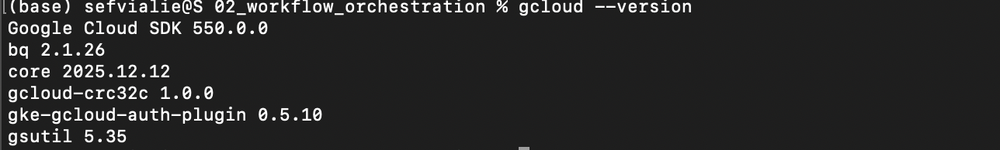

# 2022 ✅

## Week 1 Homework

In this homework we'll prepare the environment
and practice with terraform and SQL

## Question 1. Google Cloud SDK ✅

Install Google Cloud SDK. What's the version you have?

To get the version, run `gcloud --version`



```python
Google Cloud SDK 550.0.0
```


## Google Cloud account

Create an account in Google Cloud and create a project.

## Question 2. Terraform ✅

Now install terraform and go to the terraform directory (`week_1_basics_n_setup/1_terraform_gcp/terraform`)

After that, run

- `terraform init`
- `terraform plan`
- `terraform apply`

Apply the plan and copy the output (after running `apply`) to the form.

It should be the entire output - from the moment you typed `terraform init` to the very end.

[Step by step](2022/Step%20by%20step.md)

- `terraform init` → downloading provider plugins and setting up backend
    
    
    
    ```python
    (base) sefvia@de-zoomcamp:~/data-engineering-zoomcamp/01-docker-terraform/terraform/terraform/terraform_with_variables$ terraform init
    Initializing the backend...
    Initializing provider plugins...
    - Reusing previous version of hashicorp/google from the dependency lock file
    - Using previously-installed hashicorp/google v5.6.0
    
    Terraform has been successfully initialized!
    
    You may now begin working with Terraform. Try running "terraform plan" to see
    any changes that are required for your infrastructure. All Terraform commands
    should now work.
    
    If you ever set or change modules or backend configuration for Terraform,
    rerun this command to reinitialize your working directory. If you forget, other
    commands will detect it and remind you to do so if necessary.
    ```
    
- `terraform plan`
    
    ```python
    (base) sefvia@de-zoomcamp:~/data-engineering-zoomcamp/01-docker-terraform/terraform/terraform/terraform_with_variables$ terraform plan
    
    Terraform used the selected providers to generate the following execution plan. Resource actions are indicated with the following symbols:
      + create
    
    Terraform will perform the following actions:
    
      # google_bigquery_dataset.demo_dataset will be created
      + resource "google_bigquery_dataset" "demo_dataset" {
          + creation_time              = (known after apply)
          + dataset_id                 = "demo_dataset"
          + default_collation          = (known after apply)
          + delete_contents_on_destroy = false
          + effective_labels           = (known after apply)
          + etag                       = (known after apply)
          + id                         = (known after apply)
          + is_case_insensitive        = (known after apply)
          + last_modified_time         = (known after apply)
          + location                   = "US"
          + max_time_travel_hours      = (known after apply)
          + project                    = "noted-aloe-481504-u4"
          + self_link                  = (known after apply)
          + storage_billing_model      = (known after apply)
          + terraform_labels           = (known after apply)
    
          + access (known after apply)
        }
    
      # google_storage_bucket.demo-bucket will be created
      + resource "google_storage_bucket" "demo-bucket" {
          + effective_labels            = (known after apply)
          + force_destroy               = true
          + id                          = (known after apply)
          + location                    = "US"
          + name                        = "terraform-demo-terra-bucket"
          + project                     = (known after apply)
          + public_access_prevention    = (known after apply)
          + self_link                   = (known after apply)
          + storage_class               = "STANDARD"
          + terraform_labels            = (known after apply)
          + uniform_bucket_level_access = (known after apply)
          + url                         = (known after apply)
    
          + lifecycle_rule {
              + action {
                  + type          = "AbortIncompleteMultipartUpload"
                    # (1 unchanged attribute hidden)
                }
              + condition {
                  + age                    = 1
                  + matches_prefix         = []
                  + matches_storage_class  = []
                  + matches_suffix         = []
                  + with_state             = (known after apply)
                    # (3 unchanged attributes hidden)
                }
            }
    
          + versioning (known after apply)
    
          + website (known after apply)
        }
    
    Plan: 2 to add, 0 to change, 0 to destroy.
    
    ```
    
- `terraform apply`
    
    ```python
    (base) sefvia@de-zoomcamp:~/data-engineering-zoomcamp/01-docker-terraform/terraform/terraform/terraform_with_variables$ terraform apply
    
    Terraform used the selected providers to generate the following execution plan. Resource actions are indicated with the following symbols:
      + create
    
    Terraform will perform the following actions:
    
      # google_bigquery_dataset.demo_dataset will be created
      + resource "google_bigquery_dataset" "demo_dataset" {
          + creation_time              = (known after apply)
          + dataset_id                 = "demo_dataset"
          + default_collation          = (known after apply)
          + delete_contents_on_destroy = false
          + effective_labels           = (known after apply)
          + etag                       = (known after apply)
          + id                         = (known after apply)
          + is_case_insensitive        = (known after apply)
          + last_modified_time         = (known after apply)
          + location                   = "US"
          + max_time_travel_hours      = (known after apply)
          + project                    = "noted-aloe-481504-u4"
          + self_link                  = (known after apply)
          + storage_billing_model      = (known after apply)
          + terraform_labels           = (known after apply)
    
          + access (known after apply)
        }
    
      # google_storage_bucket.demo-bucket will be created
      + resource "google_storage_bucket" "demo-bucket" {
          + effective_labels            = (known after apply)
          + force_destroy               = true
          + id                          = (known after apply)
          + location                    = "US"
          + name                        = "terraform-demo-terra-bucket"
          + project                     = (known after apply)
          + public_access_prevention    = (known after apply)
          + self_link                   = (known after apply)
          + storage_class               = "STANDARD"
          + terraform_labels            = (known after apply)
          + uniform_bucket_level_access = (known after apply)
          + url                         = (known after apply)
    
          + lifecycle_rule {
              + action {
                  + type          = "AbortIncompleteMultipartUpload"
                    # (1 unchanged attribute hidden)
                }
              + condition {
                  + age                    = 1
                  + matches_prefix         = []
                  + matches_storage_class  = []
                  + matches_suffix         = []
                  + with_state             = (known after apply)
                    # (3 unchanged attributes hidden)
                }
            }
    
          + versioning (known after apply)
    
          + website (known after apply)
        }
    
    Plan: 2 to add, 0 to change, 0 to destroy.
    
    Do you want to perform these actions?
      Terraform will perform the actions described above.
      Only 'yes' will be accepted to approve.
    
      Enter a value: yes
    
    google_bigquery_dataset.demo_dataset: Creating...
    google_storage_bucket.demo-bucket: Creating...
    google_bigquery_dataset.demo_dataset: Creation complete after 1s [id=projects/noted-aloe-481504-u4/datasets/demo_dataset]
    ╷
    │ Error: googleapi: Error 409: The requested bucket name is not available. The bucket namespace is shared by all users of the system. Please select a different name and try again., conflict
    │ 
    │   with google_storage_bucket.demo-bucket,
    │   on main.tf line 16, in resource "google_storage_bucket" "demo-bucket":
    │   16: resource "google_storage_bucket" "demo-bucket" {
    │ 
    ```
    

`terraform apply -auto approve` : Generating proposed changes and auto-executing the plan

`terraform destroy` : Remove all resources managed by terraform

## Prepare Postgres

Run Postgres and load data as shown in the videos

We'll use the yellow taxi trips from January 2021:

```bash
wget ~~<https://s3.amazonaws.com/nyc-tlc/trip+data/yellow_tripdata_2021-01.csv>~~
```

update : in .parquet 

```python
wget https://d37ci6vzurychx.cloudfront.net/trip-data/yellow_tripdata_2021-01.parquet
```

You will also need the dataset with zones:

```bash
wget ~~<https://s3.amazonaws.com/nyc-tlc/misc/taxi+_zone_lookup.csv>~~

```

update:

```python
wget https://d37ci6vzurychx.cloudfront.net/misc/taxi_zone_lookup.csv
```

This is the parquet file link:

[https://d37ci6vzurychx.cloudfront.net/misc/taxi_zones.zip](https://d37ci6vzurychx.cloudfront.net/misc/taxi_zones.zip)

Download this data and put it to Postgres

[Step-by-step (python)](2022/Step-by-step%20(python).md)

[ingest_data2022.py](2022/ingest_data2022%20py.md)

[Putting Ingestion Script into Docker](2022/Putting%20Ingestion%20Script%20into%20Docker.md)

- Screenshots of pgAdmin
    
    
    
    
    

Now we can query it in pgadmin. 

[SQL Queries](2022/SQL%20Queries.md)

## Question 3. Count records ✅

How many taxi trips were there on January 15?

Consider only trips that started on January 15.

- Queries and Results
    
    ```sql
    -- Trips on January 15 --
    SELECT COUNT(*)
    FROM yellow_tripdata_2021_01
    WHERE tpep_pickup_datetime >= '2021-01-15' AND
    		tpep_pickup_datetime < '2021-01-16';
    ```
    
    
    
    53024 trips
    
- Solution
    
    ```sql
    SELECT COUNT(*)
    FROM yellow_tripdata_2021_01
    WHERE tpep_pickup_datetime::date = '2021-01-15'
    ```
    

## Question 4. Largest tip for each day ✅

Find the largest tip for each day.
On which day it was the largest tip in January?

Use the pick up time for your calculations.

(note: it's not a typo, it's "tip", not "trip")

- Queries and Results
    
    ```sql
    -- Find the largest tip for each day.
    --- On which day it was the largest tip in January?
    SELECT DATE(tpep_pickup_datetime) AS trip_date,
    		MAX(tip_amount) AS max_tip
    FROM yellow_tripdata_2021_01
    GROUP BY trip_date
    ORDER BY max_tip DESC;
    ```
    
    
    
    Answer: 20th Jan 2021
    
- Solution
    
    ```sql
    SELECT DATE_TRUNC('day', tpep_pickup_datetime) AS pickup_day
    			MAX(tip_amount) AS max_tip
    FROM yellow_tripdata_2021_01
    GROUP BY pickup_day
    ORDER BY max_tip DESC
    LIMIT 1;
    ```
    

## Question 5. Most popular destination ✅

What was the most popular destination for passengers picked up
in central park on January 14?

Use the pick up time for your calculations.

Enter the zone name (not id). If the zone name is unknown (missing), write "Unknown"

- Queries and Results
    
    ```sql
    -- What was the most popular destination for passengers picked up  in central park on January 14?
    -- Use the pick up time for your calculations.
    -- Enter the zone name (not id). If the zone name is unknown (missing), write "Unknown"
    SELECT COUNT(*) AS trip_count,
    		t."Borough" AS destination_borough,
    		COALESCE(t."Zone", 'Unknown') AS destination_zone
    FROM yellow_tripdata_2021_01 y
    LEFT JOIN taxi_zone_lookup t 
    	ON y."DOLocationID" = t."LocationID"
    WHERE y.tpep_pickup_datetime::date = '2021-01-14' AND 
    	y."PULocationID" = '43'
    GROUP BY destination_zone, destination_borough
    ORDER BY trip_count DESC;
    ```
    
    
    
- Solutions
    
    ```sql
    select coalesce (dozones. zone, 'Unknown') as zone , count (*) as cant_trips from dbt_victoria_mola. "yellow_tripdata_2021-01" as taxi
    inner join dbt_victoria_mola.taxi_zone_lookup
    on taxi. pulocationid = puzones. locationid
    as
    puzones
    left join dbt_victoria_mola. taxi_zone_lookup as dozones on taxi.dolocationid
    = dozones. locationid
    where puzones,zone ilike "%central park%'
    and tpep_pickup _datetime::date = '2021-01-14'
    group by 1
    order by cant_trips desc
    Limit 1;
    ```
    

## Question 6. Most expensive locations ✅

What's the pickup-dropoff pair with the largest
average price for a ride (calculated based on `total_amount`)?

Enter two zone names separated by a slash

For example:

"Jamaica Bay / Clinton East"

If any of the zone names are unknown (missing), write "Unknown". For example, "Unknown / Clinton East".

- Queries and Results
    
    ```sql
    -- What's the pickup-dropoff pair with the largest
    --average price for a ride (calculated based on `total_amount`)?
    -- Enter two zone names separated by a slash, e.g "Jamaica Bay / Clinton East"
    
    SELECT AVG(y.total_amount) AS avg_price,
    		COALESCE(puz."Zone", 'Unknown') || ' / ' ||
    		COALESCE(doz."Zone", 'Unknown') AS pickup_dropoff
    FROM yellow_tripdata_2021_01 y
    LEFT JOIN taxi_zone_lookup puz
    	ON y."PULocationID" = puz."LocationID"
    LEFT JOIN taxi_zone_lookup doz
    	ON y."DOLocationID" = doz."LocationID"
    GROUP BY pickup_dropoff
    ORDER BY avg_price DESC;
    ```
    
    
    
    ```sql
    || ' / ' ||
    ```
    
    means join text on the left + " / " + text on the right
    
    Why || and not +?
    
    `+`→ numeric addition
    `||` → string concatenation (SQL standard, PostgreSQL)
    
- Solutions
    
    ```sql
    -- What's the pickup-dropoff pair with the largest
    --average price for a ride (calculated based on `total_amount`)?
    -- Enter two zone names separated by a slash, e.g "Jamaica Bay / Clinton East"
    
    SELECT CONCAT (COALESCE(puzones."Zone", 'Unknown'), 
    		'/',
    		COALESCE(dozones."Zone", 'Unknown')) as pickup_dropoff,
    		AVG(total_amount) as avg_price_ride 
    FROM yellow_tripdata_2021_01 AS taxi
    LEFT JOIN taxi_zone_lookup as puzones
    ON taxi."PULocationID" = puzones."LocationID"
    LEFT JOIN taxi_zone_lookup as dozones
    ON taxi."DOLocationID" = dozones."LocationID"
    GROUP BY pickup_dropoff
    ORDER BY avg_price_ride DESC
    LIMIT 1;
    ```
    
    
    

## Submitting the solutions

- Form for submitting: [https://forms.gle/yGQrkgRdVbiFs8Vd7](https://forms.gle/yGQrkgRdVbiFs8Vd7)
- You can submit your homework multiple times. In this case, only the last submission will be used.

Deadline: 26 January (Wednesday), 22:00 CET

## Solution

Here is the solution to questions 3-6: [video](https://www.youtube.com/watch?v=HxHqH2ARfxM&list=PL3MmuxUbc_hJed7dXYoJw8DoCuVHhGEQb)