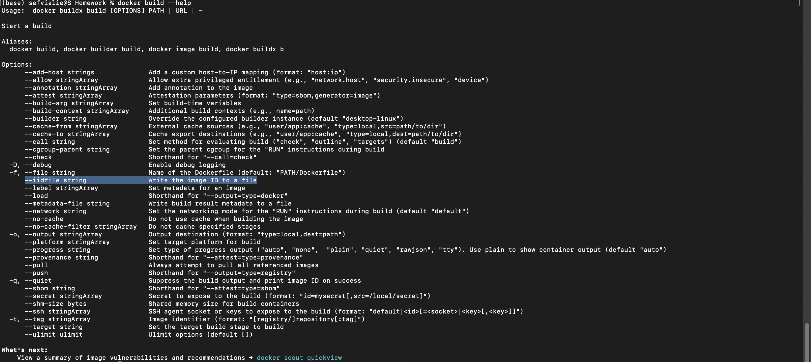

# 2023 ✅

## Week 1 Homework

In this homework we'll prepare the environment
and practice with Docker and SQL

## Question 1. Knowing docker tags ✅

Run the command to get information on Docker

`docker --help`

Now run the command to get help on the "docker build" command

Which tag has the following text? - *Write the image ID to the file*

- `-imageid string`
- `-iidfile string`
- `-idimage string`
- `-idfile string`
- Queries and Prompts
    
    
    
    Answer: `--iidfile string`
    

## Question 2. Understanding docker first run ✅

Run docker with the python:3.9 image in an interactive mode and the entrypoint of bash.
Now check the python modules that are installed ( use pip list).
How many python packages/modules are installed?

- 1
- 6
- 3
- 7
- Syntax and Answers
    
    `-it` : interactive terminal
    
    `--entrypoint=bash` : entry point of bash
    
    ```sql
    docker run --rm -it --entrypoint=bash python:3.9
    ```
    
    
    
    Answer: 3
    

## Prepare Postgres

Run Postgres and load data as shown in the videos
We'll use the green taxi trips from January 2019:

`wget <https://github.com/DataTalksClub/nyc-tlc-data/releases/download/green/green_tripdata_2019-01.csv.gz`

```sql
https://d37ci6vzurychx.cloudfront.net/trip-data/green_tripdata_2019-01.parquet
```

You will also need the dataset with zones:

`wget <https://s3.amazonaws.com/nyc-tlc/misc/taxi+_zone_lookup.csv`>

```sql
wget https://d37ci6vzurychx.cloudfront.net/misc/taxi_zone_lookup.csv
```

Download this data and put it into Postgres (with jupyter notebooks or with a pipeline)

[Step by step](2023/Step%20by%20step.md)

## Question 3. Count records ✅

How many taxi trips were totally made on January 15?

Tip: started and finished on 2019-01-15.

Remember that `lpep_pickup_datetime` and `lpep_dropoff_datetime` columns are in the format timestamp (date and hour+min+sec) and not in date.

- 20689
- 20530
- 17630
- 21090
- Queries and Results
    
    ```sql
    --How many taxi trips were totally made on January 15?
    -- Tip: started and finished on 2019-01-15.
    
    SELECT COUNT(lpep_pickup_datetime)
    FROM green_tripdata_2019_01
    WHERE lpep_pickup_datetime::date >= '2019-01-15' AND
    		lpep_pickup_datetime::date < '2019-01-16';
    ```
    
    
    
    or simply
    
    ```sql
    --How many taxi trips were totally made on January 15?
    -- Tip: started and finished on 2019-01-15.
    
    SELECT COUNT(1)
    FROM green_tripdata_2019_01
    WHERE lpep_pickup_datetime::date = '2019-01-15';
    ```
    
    
    
- Solution
    
    ```sql
    --How many taxi trips were totally made on January 15?
    -- Tip: started and finished on 2019-01-15.
    
    SELECT COUNT(1)
    FROM green_tripdata_2019_01
    WHERE lpep_pickup_datetime::date = '2019-01-15' AND
    	lpep_dropoff_datetime::date = '2019-01-15';
    
    ```
    
    
    
    The solution video:
    
    
    
    Maybe the data has changed. 
    

## Question 4. Largest trip for each day ✅

Which was the day with the largest trip distance
Use the pick up time for your calculations.

- 2019-01-18
- 2019-01-28
- 2019-01-15
- 2019-01-10
- Queries and Results
    
    ```sql
    --Which was the day with the largest trip distance
    --Use the pick up time for your calculations.
    
    SELECT MAX(trip_distance), 
    		DATE(lpep_pickup_datetime) AS pickup_date
    FROM green_tripdata_2019_01
    GROUP BY pickup_date
    ORDER BY MAX(trip_distance) DESC
    LIMIT 10;
    ```
    
    
    
    Answer: 2019-01-15
    
- Answer
    
    2019-01-15
    

## Question 5. The number of passengers ✅

In 2019-01-01 how many trips had 2 and 3 passengers?

- 2: 1282 ; 3: 266
- 2: 1532 ; 3: 126
- 2: 1282 ; 3: 254
- 2: 1282 ; 3: 274
- Queries and Results
    
    ```sql
    --In 2019-01-01 how many trips had 2 and 3 passengers?
    
    SELECT 
    	( SELECT COUNT(*)
    	  FROM green_tripdata_2019_01
    	  WHERE passenger_count = '2' AND date(lpep_pickup_datetime) = '2019-01-01') AS two_passenger_trip, 
    	( SELECT COUNT(*)
    	  FROM green_tripdata_2019_01
    	  WHERE passenger_count = '3' AND date(lpep_pickup_datetime) = '2019-01-01') AS three_passenger_trip 
    ```
    
    
    
    ```sql
    --In 2019-01-01 how many trips had 2 and 3 passengers?
    
    SELECT passenger_count, 
    		COUNT(*)
    FROM green_tripdata_2019_01
    WHERE date(lpep_pickup_datetime) = '2019-01-01'
    GROUP BY passenger_count
    ORDER BY passenger_count ASC;
    ```
    
    
    
    Same results. 
    
- Solution
    
    Again, the data may have been updated. But the solution was 2: 1282 and 3: 254
    

## Question 6. Largest tip ✅

For the passengers picked up in the Astoria Zone which was the drop off zone that had the largest tip?
We want the name of the zone, not the id.

Note: it's not a typo, it's `tip` , not `trip`

- Central Park
- Jamaica
- South Ozone Park
- Long Island City/Queens Plaza
- Query and Results
    
    ```sql
    -- For the passengers picked up in the Astoria Zone which was the drop off zone that had the largest tip?
    -- We want the name of the zone, not the id.
    
    SELECT g.lpep_pickup_datetime, 
    		g.tip_amount,
    		tdo."Zone"
    FROM green_tripdata_2019_01 g
    LEFT JOIN taxi_zone_lookup tpu
    	ON g."PULocationID" = tpu."LocationID"
    LEFT JOIN taxi_zone_lookup tdo
    	ON g."DOLocationID" = tdo."LocationID"
    WHERE tpu."Zone" = 'Astoria'
    ORDER BY g.tip_amount DESC
    LIMIT 10;
    ```
    
    
    
- Solutions
    
    Long Island City/Queens Plaza
    

## Submitting the solutions

- Form for submitting: [form](https://forms.gle/EjphSkR1b3nsdojv7)
- You can submit your homework multiple times. In this case, only the last submission will be used.

Deadline: 30 January (Monday), 22:00 CET

## Solution

See here: [https://www.youtube.com/watch?v=KIh_9tZiroA](https://www.youtube.com/watch?v=KIh_9tZiroA)