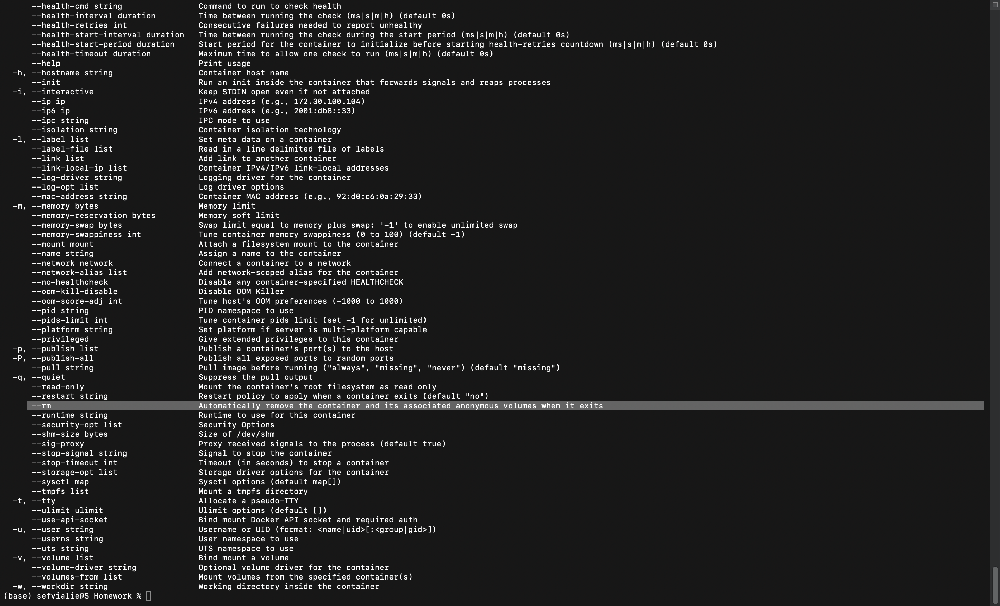

# 2024 ✅

## Module 1 Homework

ATTENTION: At the very end of the submission form, you will be required to include a link to your GitHub repository or other public code-hosting site. This repository should contain your code for solving the homework. If your solution includes code that is not in file format (such as SQL queries or shell commands), please include these directly in the README file of your repository.

## Docker & SQL

In this homework we'll prepare the environment
and practice with Docker and SQL

## Question 1. Knowing docker tags ✅

Run the command to get information on Docker

`docker --help`

Now run the command to get help on the "docker build" command:

`docker build --help`

Do the same for "docker run".

Which tag has the following text? - *Automatically remove the container when it exits*

- `-delete`
- `-rc`
- `-rmc`
- `-rm`
- Queries and Results
    
    ```sql
    docker run --help
    ```
    
    
    
    `-rm` 
    

## Question 2. Understanding docker first run ✅

Run docker with the python:3.9 image in an interactive mode and the entrypoint of bash.
Now check the python modules that are installed ( use `pip list` ).

What is version of the package *wheel* ?

- 0.42.0
- 1.0.0
- 23.0.1
- 58.1.0
- Queries and Results
    - `it` : interactive terminal
    - `-entrypoint=bash` : entry point of bash
    
    ```sql
    docker run --rm -it --entrypoint=bash python:3.9
    
    ```
    
    
    

## Prepare Postgres

Run Postgres and load data as shown in the videos
We'll use the green taxi trips from September 2019:

`wget <https://github.com/DataTalksClub/nyc-tlc-data/releases/download/green/green_tripdata_2019-09.csv.gz`>

```sql
https://d37ci6vzurychx.cloudfront.net/trip-data/green_tripdata_2019-09.parquet
```

You will also need the dataset with zones:

`wget <https://s3.amazonaws.com/nyc-tlc/misc/taxi+_zone_lookup.csv`>

Download this data and put it into Postgres (with jupyter notebooks or with a pipeline)

[Step by step](2024/Step%20by%20step.md)

## Question 3. Count records ✅

How many taxi trips were totally made on September 18th 2019?

Tip: started and finished on 2019-09-18.

Remember that `lpep_pickup_datetime` and `lpep_dropoff_datetime` columns are in the format timestamp (date and hour+min+sec) and not in date.

- 15767
- 15612
- 15859
- 89009
- Queries and Results
    
    ```sql
    -- How many taxi trips were totally made on September 18th 2019?
    -- Tip: started and finished on 2019-09-18.
    SELECT COUNT(*)
    FROM green_tripdata_2019_09 g
    WHERE date(lpep_pickup_datetime) = '2019-09-18' AND
    	date(lpep_dropoff_datetime) = '2019-09-18';
    ```
    
    
    
    Answer: 15612
    

## Question 4. Longest trip for each day ✅

Which was the pick up day with the longest trip distance?
Use the pick up time for your calculations.

Tip: For every trip on a single day, we only care about the trip with the longest distance.

- 2019-09-18
- 2019-09-16
- 2019-09-26
- 2019-09-21
- Queries and Results
    
    ```sql
    -- Which was the pick up day with the longest trip distance?
    -- Use the pick up time for your calculations.
    -- Tip: For every trip on a single day, we only care about the trip with the longest distance.
    SELECT lpep_pickup_datetime,
    		trip_distance
    FROM green_tripdata_2019_09 g
    ORDER BY trip_distance DESC
    LIMIT 10;
    ```
    
    
    
    Answer: 2019-09-26
    
- Solutions
    
    ```sql
    SELECT
        DATE("lpep_pickup_datetime") AS "pickup_date",
        MAX("trip_distance") AS "longest_trip"
    FROM
        "csv_green_tripdata_2019_09"
    GROUP BY
        DATE("lpep_pickup_datetime")
    ORDER BY
        "longest_trip" DESC
    LIMIT 1;
    ```
    
    ```sql
    +-------------+--------------+
    | pickup_date | longest_trip |
    |-------------+--------------|
    | 2019-09-26  | 341.64       |
    +-------------+--------------+
    ```
    

## Question 5. Three biggest pick up Boroughs ✅

Consider lpep_pickup_datetime in '2019-09-18' and ignoring Borough has Unknown

Which were the 3 pick up Boroughs that had the maximum total_amount?

- **"Brooklyn" "Manhattan" "Queens"**
- "Bronx" "Brooklyn" "Manhattan"
- "Bronx" "Manhattan" "Queens"
- "Brooklyn" "Queens" "Staten Island"
- Queries and Results
    
    ```sql
    --Consider lpep_pickup_datetime in '2019-09-18' and ignoring Borough has Unknown
    --Which were the 3 pick up Boroughs that had the maximum total_amount?
    SELECT t."Borough", 
    		SUM(g.total_amount) AS total_amount
    FROM green_tripdata_2019_09 g
    LEFT JOIN taxi_zone_lookup t
    	ON g."PULocationID" = t."LocationID"
    WHERE date(lpep_pickup_datetime) = '2019-09-18' AND
    	t."Borough" != 'Unknown'
    GROUP BY t."Borough"
    ORDER BY total_amount DESC
    LIMIT 10; -- yes we can just limit to 3, but to see things clearly here I prompted 10
    ```
    
    
    
- Solutions
    
    According to the solutions: (this one is grouped by **zone**)
    
    ```sql
    --Consider lpep_pickup_datetime in '2019-09-18' and ignoring Borough has Unknown
    --Which were the 3 pick up Boroughs that had the maximum total_amount?
    SELECT t."Borough", 
    		t."Zone",
    		SUM(g.total_amount) AS sum_total_amount
    FROM green_tripdata_2019_09 g
    LEFT JOIN taxi_zone_lookup t
    	ON g."PULocationID" = t."LocationID"
    WHERE date(lpep_pickup_datetime) = '2019-09-18' AND
    	t."Borough" != 'Unknown'
    GROUP BY t."Borough", t."Zone"
    ORDER BY sum_total_amount DESC
    LIMIT 3;
    ```
    
    
    

## Question 6. Largest tip ✅

For the passengers picked up in September 2019 in the zone name Astoria which was the drop off zone that had the largest tip?
We want the name of the zone, not the id.

Note: it's not a typo, it's `tip` , not `trip`

- Central Park
- Jamaica
- **JFK Airport**
- Long Island City/Queens Plaza
- Queries and Results
    
    ```sql
    --For the passengers picked up in September 2019 in the zone name Astoria which was the drop off zone that had the largest tip?
    --We want the name of the zone, not the id.
    SELECT t."Zone" AS pickup_zone,
    		MAX(tip_amount) AS max_tip_amount, 
    		d."Zone" AS dropoff_zone
    FROM green_tripdata_2019_09 g
    LEFT JOIN taxi_zone_lookup t
    	ON g."PULocationID" = t."LocationID"
    LEFT JOIN taxi_zone_lookup d
    	ON g."DOLocationID" = d."LocationID"
    WHERE t."Zone" = 'Astoria'
    GROUP BY t."Zone", d."Zone"
    ORDER BY max_tip_amount DESC
    LIMIT 10;
    ```
    
    
    
- Solutions
    
    ```sql
    SELECT
        puz."Zone" AS pickup_zone,
        doz."Zone" AS dropoff_zone,
        g."tip_amount"
    FROM
        "csv_green_tripdata_2019_09" g
    INNER JOIN
        "zone" puz ON g."PULocationID" = puz."LocationID"
    INNER JOIN
        "zone" doz ON g."DOLocationID" = doz."LocationID"
    WHERE
        puz."Zone" = 'Astoria'
    ORDER BY
        g."tip_amount" DESC
    LIMIT 1;
    ```
    
    ```sql
    +-------------+--------------+------------+
    | pickup_zone | dropoff_zone | tip_amount |
    |-------------+--------------+------------|
    | Astoria     | JFK Airport  | 62.31      |
    +-------------+--------------+------------+
    
    ```
    

## Terraform

In this section homework we'll prepare the environment by creating resources in GCP with Terraform.

In your VM on GCP/Laptop/GitHub Codespace install Terraform.
Copy the files from the course repo
[here](https://github.com/DataTalksClub/data-engineering-zoomcamp/tree/main/01-docker-terraform/1_terraform_gcp/terraform) to your VM/Laptop/GitHub Codespace.

Modify the files as necessary to create a GCP Bucket and Big Query Dataset.

## Question 7. Creating Resources ✅

After updating the [main.tf](http://main.tf/) and [variable.tf](http://variable.tf/) files run:

```
terraform apply
```

Paste the output of this command into the homework submission form.

- Results
    
    Making demo-bucket and demo-dataset. 
    
    [main.tf](2024/main%20tf.md)
    
    [variables.tf](2024/variables%20tf.md)
    

## Submitting the solutions

- Form for submitting: [https://courses.datatalks.club/de-zoomcamp-2024/homework/hw01](https://courses.datatalks.club/de-zoomcamp-2024/homework/hw01)
- You can submit your homework multiple times. In this case, only the last submission will be used.

Deadline: 29 January, 23:00 CET