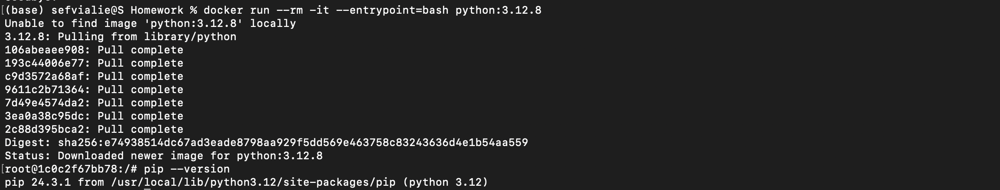

# 2025 ✅

# Module 1 Homework: Docker & SQL

Solution: [solution.md](https://www.notion.so/solution.md)

In this homework we'll prepare the environment and practice Docker and SQL

When submitting your homework, you will also need to include a link to your GitHub repository or other public code-hosting site.

This repository should contain the code for solving the homework.

When your solution has SQL or shell commands and not code
(e.g. python files) file format, include them directly in
the README file of your repository.

## Question 1. Understanding docker first run ✅

Run docker with the `python:3.12.8` image in an interactive mode, use the entrypoint `bash`.

What's the version of `pip` in the image?

- **24.3.1**
- 24.2.1
- 23.3.1
- 23.2.1
- Steps and Results
    
    ```sql
    docker run --rm -it --entrypoint=bash python:3.12.8
    ```
    
    
    

## Question 2. Understanding Docker networking and docker-compose ✅

Given the following `docker-compose.yaml`, what is the `hostname` and `port` that **pgadmin** should use to connect to the postgres database?

```yaml
services:
  db:
    container_name: postgres
    image: postgres:17-alpine
    environment:
      POSTGRES_USER: 'postgres'
      POSTGRES_PASSWORD: 'postgres'
      POSTGRES_DB: 'ny_taxi'
    ports:
      - '5433:5432'
    volumes:
      - vol-pgdata:/var/lib/postgresql/data

  pgadmin:
    container_name: pgadmin
    image: dpage/pgadmin4:latest
    environment:
      PGADMIN_DEFAULT_EMAIL: "pgadmin@pgadmin.com"
      PGADMIN_DEFAULT_PASSWORD: "pgadmin"
    ports:
      - "8080:80"
    volumes:
      - vol-pgadmin_data:/var/lib/pgadmin

volumes:
  vol-pgdata:
    name: vol-pgdata
  vol-pgadmin_data:
    name: vol-pgadmin_data

```

- postgres:5433
- localhost:5432
- db:5433
- **postgres:5432**
- **db:5432**

If there are more than one answers, select only one of them

## Prepare Postgres

Run Postgres and load data as shown in the videos
We'll use the green taxi trips from October 2019:

```bash
wget <https://github.com/DataTalksClub/nyc-tlc-data/releases/download/green/green_tripdata_2019-10.csv.gz>
```

```sql
https://d37ci6vzurychx.cloudfront.net/trip-data/green_tripdata_2019-10.parquet
```

You will also need the dataset with zones:

```bash
wget <https://github.com/DataTalksClub/nyc-tlc-data/releases/download/misc/taxi_zone_lookup.csv>

```

Download this data and put it into Postgres.

You can use the code from the course. It's up to you whether
you want to use Jupyter or a python script.

[Step by step](2025/Step%20by%20step.md)

## Question 3. Trip Segmentation Count ✅

During the period of October 1st 2019 (inclusive) and November 1st 2019 (exclusive), how many trips, **respectively**, happened:

1. Up to 1 mile
2. In between 1 (exclusive) and 3 miles (inclusive),
3. In between 3 (exclusive) and 7 miles (inclusive),
4. In between 7 (exclusive) and 10 miles (inclusive),
5. Over 10 miles

Answers:

- 104,802; 197,670; 110,612; 27,831; 35,281
- **104,802; 198,924; 109,603; 27,678; 35,189**
- 104,793; 201,407; 110,612; 27,831; 35,281
- 104,793; 202,661; 109,603; 27,678; 35,189
- 104,838; 199,013; 109,645; 27,688; 35,202
- Queries and Results
    
    ```sql
    --During the period of October 1st 2019 (inclusive) and November 1st 2019 (exclusive), how many trips,respectively, happened:
    --1. Up to 1 mile
    --2. In between 1 (exclusive) and 3 miles (inclusive),
    --3. In between 3 (exclusive) and 7 miles (inclusive),
    --4. In between 7 (exclusive) and 10 miles (inclusive),
    --5. Over 10 miles
    SELECT 
    	CASE 
    		WHEN trip_distance <= 1 THEN 'Up to 1 mile'
    		WHEN trip_distance > 1 AND trip_distance <= 3 THEN 'Between 1 and 3 miles'
    		WHEN trip_distance > 3 AND trip_distance <= 7 THEN 'Between 3 and 7 miles'
    		WHEN trip_distance > 7 AND trip_distance <= 10 THEN 'Between 7 and 10 miles'
    		WHEN trip_distance >= 10 THEN 'Over 10 miles'
    	END AS distance_range,
    	COUNT(*) AS trip_count
    FROM green_tripdata_2019_10
    WHERE lpep_pickup_datetime >= '2019-10-01' AND 
    		lpep_pickup_datetime < '2019-11-01' AND
    		lpep_dropoff_datetime >= '2019-10-01' AND
    		lpep_dropoff_datetime < '2019-11-01'
    GROUP BY distance_range;
    ```
    
    
    

## Question 4. Longest trip for each day ✅

Which was the pick up day with the longest trip distance?
Use the pick up time for your calculations.

Tip: For every day, we only care about one single trip with the longest distance.

- 2019-10-11
- 2019-10-24
- 2019-10-26
- **2019-10-31**
- Queries and Results
    
    ```sql
    --Which was the pick up day with the longest trip distance?
    --Use the pick up time for your calculations.
    --Tip: For every day, we only care about one single trip with the longest distance.
    SELECT date(lpep_pickup_datetime) AS pickup_date,
    		MAX(trip_distance) AS longest_distance
    FROM green_tripdata_2019_10
    GROUP BY pickup_date
    ORDER BY longest_distance DESC
    LIMIT 10;
    ```
    
    
    

## Question 5. Three biggest pickup zones ✅

Which were the top pickup locations with over 13,000 in
`total_amount` (across all trips) for 2019-10-18?

Consider only `lpep_pickup_datetime` when filtering by date.

- **East Harlem North, East Harlem South, Morningside Heights**
- East Harlem North, Morningside Heights
- Morningside Heights, Astoria Park, East Harlem South
- Bedford, East Harlem North, Astoria Park
- Queries and Results
    
    ```sql
    -- Which were the top pickup locations with over 13,000 in 
    --`total_amount` (across all trips) for 2019-10-18?
    --Consider only `lpep_pickup_datetime` when filtering by date.
    SELECT t."Zone" AS pickup_zone,
    		ROUND(SUM(g.total_amount)::numeric, 2) AS total_amount
    FROM green_tripdata_2019_10 g
    LEFT JOIN taxi_zone_lookup t
    	ON g."PULocationID" = t."LocationID"
    WHERE DATE(g.lpep_pickup_datetime) = '2019-10-18'
    GROUP BY t."Zone"
    HAVING SUM(g.total_amount) > 13000;
    ```
    
    
    

## Question 6. Largest tip ✅

For the passengers picked up in October 2019 in the zone
named "East Harlem North" which was the drop off zone that had
the largest tip?

Note: it's `tip` , not `trip`

We need the name of the zone, not the ID.

- Yorkville West
- **JFK Airport**
- East Harlem North
- East Harlem South
- Questions and Results
    
    ```sql
    --For the passengers picked up in October 2019 in the zone
    --named "East Harlem North" which was the drop off zone that had
    --the largest tip?
    SELECT zpu."Zone" AS pickup_zone,
    		zdo."Zone" AS dropoff_zone,
    		MAX(tip_amount) AS largest_tip,
    		g.lpep_pickup_datetime AS pickup_datetime
    FROM green_tripdata_2019_10 g
    LEFT JOIN taxi_zone_lookup zpu
    	ON g."PULocationID" = zpu."LocationID"
    LEFT JOIN taxi_zone_lookup zdo
    	ON g."DOLocationID" = zdo."LocationID"
    WHERE zpu."Zone" = 'East Harlem North'
    GROUP BY pickup_zone, dropoff_zone, pickup_datetime
    ORDER BY largest_tip DESC
    LIMIT 10;
    ```
    
    
    

## Terraform

In this section homework we'll prepare the environment by creating resources in GCP with Terraform.

In your VM on GCP/Laptop/GitHub Codespace install Terraform.
Copy the files from the course repo
[here](https://www.notion.so/01-docker-terraform/1_terraform_gcp/terraform) to your VM/Laptop/GitHub Codespace.

Modify the files as necessary to create a GCP Bucket and Big Query Dataset.

## Question 7. Terraform Workflow ✅

Which of the following sequences, **respectively**, describes the workflow for:

1. Downloading the provider plugins and setting up backend,
2. Generating proposed changes and auto-executing the plan
3. Remove all resources managed by terraform`

Answers:

- terraform import, terraform apply -y, terraform destroy
- teraform init, terraform plan -auto-apply, terraform rm
- terraform init, terraform run -auto-approve, terraform destroy
- terraform init, terraform apply -auto-approve, terraform destroy
- terraform import, terraform apply -y, terraform rm

## Submitting the solutions

- Form for submitting: [https://courses.datatalks.club/de-zoomcamp-2025/homework/hw1](https://courses.datatalks.club/de-zoomcamp-2025/homework/hw1)