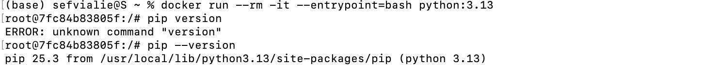

# 2026 ✅

# Module 1 Homework: Docker & SQL

In this homework we'll prepare the environment and practice Docker and SQL

When submitting your homework, you will also need to include a link to your GitHub repository or other public code-hosting site.

This repository should contain the code for solving the homework.

When your solution has SQL or shell commands and not code (e.g. python files) file format, include them directly in the README file of your repository.

## Question 1. Understanding Docker images

Run docker with the `python:3.13` image. Use an entrypoint `bash` to interact with the container.

What's the version of `pip` in the image?

- **25.3 ✅**
- 24.3.1
- 24.2.1
- 23.3.1
- Answer
    
    ```jsx
    docker run --rm -it --entrypoint=bash python:3.13
    ```
    
    
    

## Question 2. Understanding Docker networking and docker-compose

Given the following `docker-compose.yaml`, what is the `hostname` and `port` that pgadmin should use to connect to the postgres database?

```yaml
services:
  db:
    container_name: postgres
    image: postgres:17-alpine
    environment:
      POSTGRES_USER: 'postgres'
      POSTGRES_PASSWORD: 'postgres'
      POSTGRES_DB: 'ny_taxi'
    ports:
      - '5433:5432'
    volumes:
      - vol-pgdata:/var/lib/postgresql/data

  pgadmin:
    container_name: pgadmin
    image: dpage/pgadmin4:latest
    environment:
      PGADMIN_DEFAULT_EMAIL: "pgadmin@pgadmin.com"
      PGADMIN_DEFAULT_PASSWORD: "pgadmin"
    ports:
      - "8080:80"
    volumes:
      - vol-pgadmin_data:/var/lib/pgadmin

volumes:
  vol-pgdata:
    name: vol-pgdata
  vol-pgadmin_data:
    name: vol-pgadmin_data

```

- postgres:5433
- localhost:5432
- db:5433
- **postgres:5432**
- **db:5432**

If multiple answers are correct, select any

## Prepare the Data

Download the green taxi trips data for November 2025:

```bash
wget <https://d37ci6vzurychx.cloudfront.net/trip-data/green_tripdata_2025-11.parquet>

```

You will also need the dataset with zones:

```bash
wget <https://github.com/DataTalksClub/nyc-tlc-data/releases/download/misc/taxi_zone_lookup.csv>
```

- Step by step
    
    Verify docker-compose.yaml to start pgadmin and pgdatabase:
    
    [docker-compose.yaml](2026/docker-compose%20yaml.md)
    
    ```jsx
    docker compose up -d
    ```
    
    Check the database:
    
    1. via pgcli
        
        ```jsx
        pgcli -h localhost -p 5432 -u root -d ny_taxi
        ```
        
        
        
    2. via pgadmin
        
        ```jsx
        Open: http://localhost:8080
        Login: admin@admin.com / root
        Add server:
        Host: pgdatabase
        User: root
        Password: root
        DB: ny_taxi
        If you can connect → DB is ready.
        ```
        
    
    Make the ingestion file:
    
    [ingest_data2026.py](2026/ingest_data2026%20py.md)
    
    Containerize pipeline by building a docker image: Create a `Dockerfile`
    
    ```jsx
    FROM python:3.9-slim
    
    RUN pip install --no-cache-dir pandas pyarrow sqlalchemy psycopg2-binary requests click tqdm
    
    WORKDIR /app 
    COPY ingest_data2026.py .
    
    ENTRYPOINT ["python", "ingest_data2025.py"]
    ```
    
    Build container 
    
    ```jsx
    docker build -t taxi_ingest:2026 .
    ```
    
    Run Ingestion Container
    
    ```jsx
    docker run --rm \
      --network hw-network \
      taxi_ingest:2026 \
      --pg_user=root \
      --pg_pass=root \
      --pg_host=pgdatabase \
      --pg_port=5432 \
      --pg_db=ny_taxi \
      --pg_year=2025 \
      --pg_month=11 \
      --ingest_zones
    ```
    

## Question 3. Counting short trips ✅

For the trips in November 2025 (lpep_pickup_datetime between '2025-11-01' and '2025-12-01', exclusive of the upper bound), how many trips had a `trip_distance` of less than or equal to 1 mile?

- 7,853
- **8,007**
- 8,254
- 8,421
- Answer
    
    ```jsx
    -- November 2025 (lpep_pickup_datetime between '2025-11-01' and '2025-12-01', 
    -- exclusive of the upper bound), 
    --how many trips had a trip_distance of less than or equal to 1 mile?
    SELECT COUNT(*)
    FROM public.green_taxi_data_2025_11
    WHERE lpep_pickup_datetime >= '2025-11-01' AND lpep_pickup_datetime < '2025-12-01'
    AND trip_distance <= 1
    
    ```
    
    
    

## Question 4. Longest trip for each day ✅

Which was the pick up day with the longest trip distance? Only consider trips with `trip_distance` less than 100 miles (to exclude data errors).

Use the pick up time for your calculations.

- **2025-11-14**
- 2025-11-20
- 2025-11-23
- 2025-11-25
- Answer
    
    ```jsx
    --Which was the pick up day with the longest trip distance? 
    --Only consider trips with trip_distance less than 100 miles (to exclude data errors).
    SELECT lpep_pickup_datetime, trip_distance
    FROM public.green_taxi_data_2025_11
    WHERE trip_distance < 100
    ORDER BY trip_distance DESC
    LIMIT 5
    
    ```
    
    
    

## Question 5. Biggest pickup zone

Which was the pickup zone with the largest `total_amount` (sum of all trips) on November 18th, 2025?

- **East Harlem North**
- East Harlem South
- Morningside Heights
- Forest Hills
- Answer
    
    ```jsx
    --Which was the pickup zone with the largest total_amount (sum of all trips) 
    --on November 18th, 2025?
    SELECT p."PULocationID", SUM(p.total_amount), z."Zone"
    FROM public.green_taxi_data_2025_11 p
    JOIN public.taxi_zones z
    ON p."PULocationID" = z."LocationID"
    WHERE lpep_pickup_datetime >= '2025-11-18' AND lpep_pickup_datetime < '2025-11-19'
    GROUP BY p."PULocationID", z."Zone"
    ORDER BY 2 DESC
    LIMIT 5
    
    ```
    
    
    

## Question 6. Largest tip

For the passengers picked up in the zone named "East Harlem North" in November 2025, which was the drop off zone that had the largest tip?

Note: it's `tip` , not `trip`. We need the name of the zone, not the ID.

- JFK Airport
- **Yorkville West**
- East Harlem North
- LaGuardia Airport
- Apply
    
    ```jsx
    --For the passengers picked up in the zone named "East Harlem North" in November 2025, 
    --which was the drop off zone that had the largest tip?
    SELECT  p."DOLocationID", dp."Zone", p.tip_amount
    FROM public.green_taxi_data_2025_11 p
    JOIN public.taxi_zones pu
    ON p."PULocationID" = pu."LocationID"
    JOIN public.taxi_zones dp
    ON p."DOLocationID" = dp."LocationID"
    WHERE pu."Zone" = 'East Harlem North'
    ORDER BY 3 DESC
    LIMIT 5
    ```
    
    
    

## Terraform

In this section homework we'll prepare the environment by creating resources in GCP with Terraform.

In your VM on GCP/Laptop/GitHub Codespace install Terraform.
Copy the files from the course repo
[here](https://www.notion.so/01-docker-terraform/terraform/terraform) to your VM/Laptop/GitHub Codespace.

Modify the files as necessary to create a GCP Bucket and Big Query Dataset.

## Question 7. Terraform Workflow

Which of the following sequences, respectively, describes the workflow for:

1. Downloading the provider plugins and setting up backend,
2. Generating proposed changes and auto-executing the plan
3. Remove all resources managed by terraform`

Answers:

- terraform import, terraform apply -y, terraform destroy
- teraform init, terraform plan -auto-apply, terraform rm
- terraform init, terraform run -auto-approve, terraform destroy
- **terraform init, terraform apply -auto-approve, terraform destroy**
- terraform import, terraform apply -y, terraform rm

## Submitting the solutions

- Form for submitting: [https://courses.datatalks.club/de-zoomcamp-2026/homework/hw1](https://courses.datatalks.club/de-zoomcamp-2026/homework/hw1)

## Learning in Public

We encourage everyone to share what they learned. This is called "learning in public".

### Why learn in public?

- Accountability: Sharing your progress creates commitment and motivation to continue
- Feedback: The community can provide valuable suggestions and corrections
- Networking: You'll connect with like-minded people and potential collaborators
- Documentation: Your posts become a learning journal you can reference later
- Opportunities: Employers and clients often discover talent through public learning

You can read more about the benefits [here](https://alexeyondata.substack.com/p/benefits-of-learning-in-public-and).

Don't worry about being perfect. Everyone starts somewhere, and people love following genuine learning journeys!

### Example post for LinkedIn

```
🚀 Week 1 of Data Engineering Zoomcamp by @DataTalksClub complete!

Just finished Module 1 - Docker & Terraform. Learned how to:

✅ Containerize applications with Docker and Docker Compose
✅ Set up PostgreSQL databases and write SQL queries
✅ Build data pipelines to ingest NYC taxi data
✅ Provision cloud infrastructure with Terraform

Here's my homework solution: <LINK>

Following along with this amazing free course - who else is learning data engineering?

You can sign up here: <https://github.com/DataTalksClub/data-engineering-zoomcamp/>

```

### Example post for Twitter/X

```
🐳 Module 1 of Data Engineering Zoomcamp done!

- Docker containers
- Postgres & SQL
- Terraform & GCP
- NYC taxi data pipeline

My solution: <LINK>

Free course by @DataTalksClub: <https://github.com/DataTalksClub/data-engineering-zoomcamp/>

```