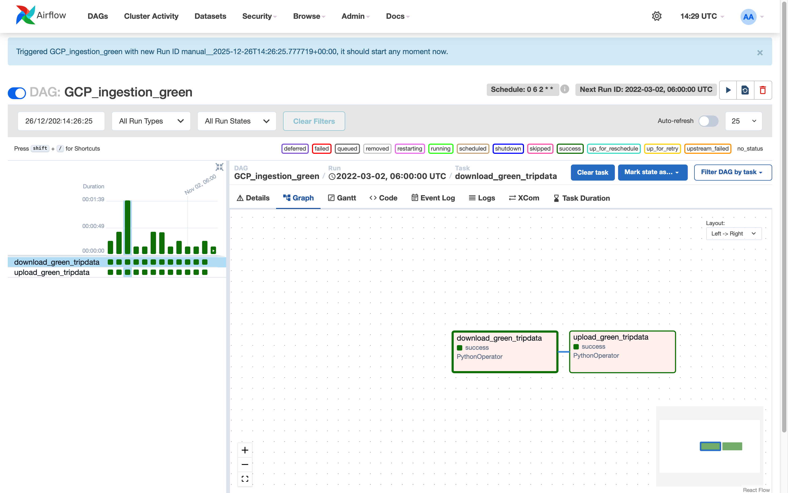

# Step-by-step

[green_data_2022_ingest.py](Step-by-step/green_data_2022_ingest%20py.md)

Ingesting to GCS with Airflow succeed 



# Put it inside BigQuery:

```sql
CREATE OR REPLACE EXTERNAL TABLE `noted-aloe-481504-u4.nytaxi.green_tripdata`
OPTIONS (
  format = 'PARQUET',
  uris = ['gs://zoomcamp-datalake-sefvia/raw/green/2022/*.parquet']
);
```


Successfully loaded. 

