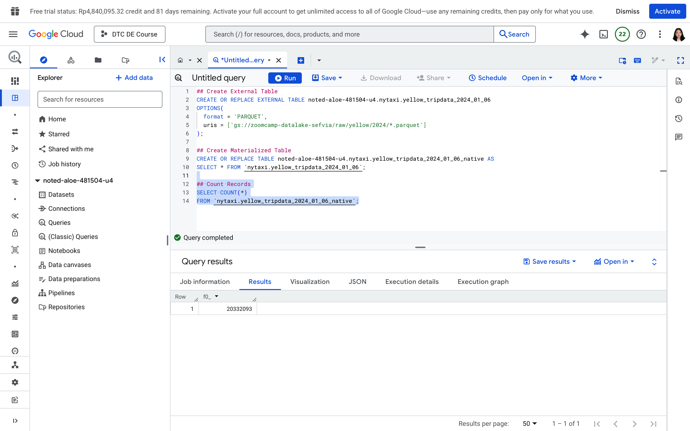

# 2025 ✅

## Module 3 Homework

ATTENTION: At the end of the submission form, you will be required to include a link to your GitHub repository or other public code-hosting site.
This repository should contain your code for solving the homework. If your solution includes code that is not in file format (such as SQL queries or
shell commands), please include these directly in the README file of your repository.

**Important Note:**

For this homework we will be using the Yellow Taxi Trip Records for **January 2024 - June 2024 NOT the entire year of data**
Parquet Files from the New York
City Taxi Data found here: 

```sql
 [https://www.nyc.gov/site/tlc/about/tlc-trip-record-data.page](https://www.nyc.gov/site/tlc/about/tlc-trip-record-data.page) 
```

If you are using orchestration such as Kestra, Mage, Airflow or Prefect etc. do not load the data into Big Query using the orchestrator.
Stop with loading the files into a bucket. 

**Load Script:** You can manually download the parquet files and upload them to your GCS Bucket or you can use the linked script [here](https://www.notion.so/load_yellow_taxi_data.py):
You will simply need to generate a Service Account with GCS Admin Priveleges or be authenticated with the Google SDK and update the bucket name in the script to the name of your bucket
Nothing is fool proof so make sure that all 6 files show in your GCS Bucket before begining.

**NOTE:** You will need to use the PARQUET option files when creating an External Table

**BIG QUERY SETUP:**

Create an external table using the Yellow Taxi Trip Records. 
Create a (regular/materialized) table in BQ using the Yellow Taxi Trip Records (do not partition or cluster this table). 

```sql
CREATE OR REPLACE EXTERNAL TABLE noted-aloe-481504-u4.nytaxi.yellow_tripdata_2024_01_06
OPTIONS(
  format = 'PARQUET',
  uris = ['gs://zoomcamp-datalake-sefvia/raw/yellow/2024/*.parquet']
);

## Create Materialized Table
CREATE OR REPLACE TABLE noted-aloe-481504-u4.nytaxi.yellow_tripdata_2024_01_06_native AS
SELECT * FROM `nytaxi.yellow_tripdata_2024_01_06`;
```

## Question 1: ✅

Question 1: What is count of records for the 2024 Yellow Taxi Data?

- 65,623
- 840,402
- **20,332,093**
- 85,431,289
- Queries and Results
    
    ```sql
    ## Count Records
    SELECT COUNT(*)
    FROM `nytaxi.yellow_tripdata_2024_01_06_native`;
    ```
    
    
    

## Question 2: ✅

Write a query to count the distinct number of PULocationIDs for the entire dataset on both the tables.

What is the **estimated amount** of data that will be read when this query is executed on the External Table and the Table?

- 18.82 MB for the External Table and 47.60 MB for the Materialized Table
- **0 MB for the External Table and 155.12 MB for the Materialized Table**
- 2.14 GB for the External Table and 0MB for the Materialized Table
- 0 MB for the External Table and 0MB for the Materialized Table
- Queries and Results
    
    ```sql
    ## Count Distinct PULocationID
    ##External Table
    SELECT COUNT(DISTINCT PULocationID) 
    FROM `nytaxi.yellow_tripdata_2024_01_06`;
    
    ##Materialized Table
    SELECT COUNT(DISTINCT PULocationID)
    FROM `nytaxi.yellow_tripdata_2024_01_06_native`;
    
    ```
    
    
    
    
    

## Question 3: ✅

Write a query to retrieve the PULocationID from the table (not the external table) in BigQuery. Now write a query to retrieve the PULocationID and DOLocationID on the same table. Why are the estimated number of Bytes different?

- **BigQuery is a columnar database, and it only scans the specific columns requested in the query. Querying two columns (PULocationID, DOLocationID) requires
reading more data than querying one column (PULocationID), leading to a higher estimated number of bytes processed.**
- BigQuery duplicates data across multiple storage partitions, so selecting two columns instead of one requires scanning the table twice,
doubling the estimated bytes processed.
- BigQuery automatically caches the first queried column, so adding a second column increases processing time but does not affect the estimated bytes scanned.
- When selecting multiple columns, BigQuery performs an implicit join operation between them, increasing the estimated bytes processed
- Queries and Result
    
    ```sql
    ## Retrieve PULocationID
    SELECT PULocationID
    FROM `nytaxi.yellow_tripdata_2024_01_06_native`;
    
    ##Retrieve PULocationID DOLocationID
    SELECT PULocationID, DOLocationID
    FROM `nytaxi.yellow_tripdata_2024_01_06_native`;
    ```
    
    
    
    
    

## Question 4: ✅

How many records have a fare_amount of 0?

- 128,210
- 546,578
- 20,188,016
- **8,333**
- Queries and Results
    
    ```sql
    ##Records with fare_amount = 0
    SELECT COUNT(*)
    FROM `nytaxi.yellow_tripdata_2024_01_06`
    WHERE fare_amount = 0;
    ```
    
    
    

## Question 5: ✅

What is the best strategy to make an optimized table in Big Query if your query will always filter based on tpep_dropoff_datetime and order the results by VendorID (Create a new table with this strategy)

- **Partition by tpep_dropoff_datetime and Cluster on VendorID**
- Cluster on by tpep_dropoff_datetime and Cluster on VendorID
- Cluster on tpep_dropoff_datetime Partition by VendorID
- Partition by tpep_dropoff_datetime and Partition by VendorID
- Queries and Results
    
    ```sql
    ## Partition By tpep_dropoff_datetime, Cluster by VendorID
    CREATE OR REPLACE TABLE `nytaxi.yellow_tripdata_2024_01_06_partitioned_clustered`
    PARTITION BY DATE(tpep_dropoff_datetime)
    CLUSTER BY VendorID AS
    SELECT * FROM `nytaxi.yellow_tripdata_2024_01_06`;
    ```
    
    
    

## Question 6: ✅

Write a query to retrieve the distinct VendorIDs between tpep_dropoff_datetime
2024-03-01 and 2024-03-15 (inclusive)</br>

Use the materialized table you created earlier in your from clause and note the estimated bytes. Now change the table in the from clause to the partitioned table you created for question 5 and note the estimated bytes processed. What are these values? </br>

Choose the answer which most closely matches.</br>

- 12.47 MB for non-partitioned table and 326.42 MB for the partitioned table
- **310.24 MB for non-partitioned table and 26.84 MB for the partitioned table**
- 5.87 MB for non-partitioned table and 0 MB for the partitioned table
- 310.31 MB for non-partitioned table and 285.64 MB for the partitioned table
- Queries and Results
    
    ```sql
    ##Write a query to retrieve the distinct VendorIDs between tpep_dropoff_datetime 2024-03-01 and 2024-03-15 (inclusive)
    ## Materialized Table
    SELECT DISTINCT(VendorID)
    FROM `nytaxi.yellow_tripdata_2024_01_06_native`
    WHERE tpep_dropoff_datetime >= '2024-03-01' AND
          tpep_dropoff_datetime < '2024-03-16';
    
    ## Partitioned and Clustered Table
    SELECT DISTINCT(VendorID)
    FROM `nytaxi.yellow_tripdata_2024_01_06_partitioned_clustered`
    WHERE tpep_dropoff_datetime >= '2024-03-01' AND
          tpep_dropoff_datetime < '2024-03-16';
    ```
    
    
    
    
    

## Question 7: ✅

Where is the data stored in the External Table you created?

- Big Query
- Container Registry
- **GCP Bucket**
- Big Table

## Question 8: ✅

It is best practice in Big Query to always cluster your data:

- True
- **False**
- Reason
    
    Clustering is less effective for small datasets (e.g., under 1 GB), where partitioning or clustering adds metadata overhead and costs. 
    
    False
    
    While clustering can improve query performance and reduce costs by organizing data based on specified columns, it is not always the best practice in every scenario. If queries often filter or aggregate data based on certain columns, clustering those columns can help.
    
    Clustering is most beneficial for large tables. For smaller tables, the performance gains may be negligible.
    
    Clustering can increase storage costs due to additional metadata and reorganization overhead.
    

## (Bonus: Not worth points) Question 9:

No Points: Write a `SELECT count(*)` query FROM the materialized table you created. How many bytes does it estimate will be read? Why?

Zero


BigQuery answered COUNT(*) using table metadata, without scanning the data.

BigQuery already stores:
total row count
file statistics
partition metadata
So it can return COUNT(*) instantly, without touching the underlying data blocks.
That’s why:
Bytes processed = 0 B
Query duration = ~0 sec

## Submitting the solutions

Form for submitting: [https://courses.datatalks.club/de-zoomcamp-2025/homework/hw3](https://courses.datatalks.club/de-zoomcamp-2025/homework/hw3)

## Solution

Solution: [https://www.youtube.com/watch?v=wpLmImIUlPg](https://www.youtube.com/watch?v=wpLmImIUlPg)