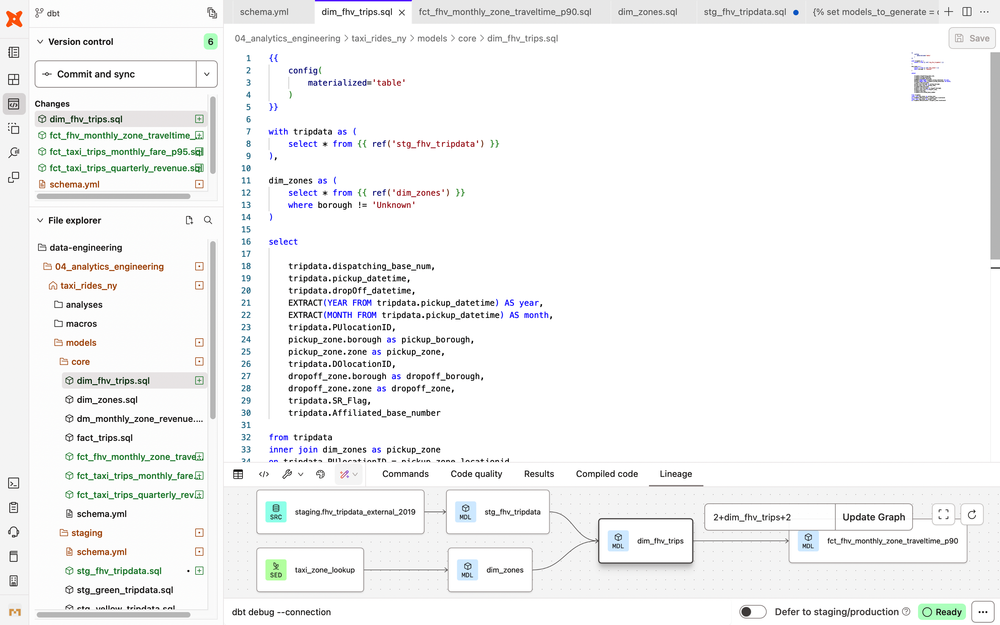

# 2024 ✅

## **Module 4 Homework**

**In this homework, we'll use the models developed during the week 4 videos and enhance the already presented dbt project using the already loaded Taxi data for fhv vehicles for year 2019 in our DWH.**

**This means that in this homework we use the following data [Datasets list](https://github.com/DataTalksClub/nyc-tlc-data/)**

- **Yellow taxi data - Years 2019 and 2020**
- **Green taxi data - Years 2019 and 2020**
- **fhv data - Year 2019.**

**We will use the data loaded for:**

- **Building a source table: `stg_fhv_tripdata`**
- **Building a fact table: `fact_fhv_trips`**
- **Create a dashboard**

**If you don't have access to GCP, you can do this locally using the ingested data from your Postgres database
instead. If you have access to GCP, you don't need to do it for local Postgres - only if you want to.**

> **Note: if your answer doesn't match exactly, select the closest option**
> 

### **Question 1: ✅**

**What happens when we execute dbt build --vars '{'is_test_run':'true'}'**
You'll need to have completed the ["Build the first dbt models"](https://www.youtube.com/watch?v=UVI30Vxzd6c) video.

- It's the same as running *dbt build*
- It applies a *limit 100* to all of our models
- **It applies a *limit 100* only to our staging models ✅**
- Nothing
- Reason
    
    Because we only explicit the macros in the staging models. 
    

### **Question 2: ✅**

**What is the code that our CI job will run? Where is this code coming from?**

- The code that has been merged into the main branch
- The code that is behind the creation object on the dbt_cloud_pr_ schema
- The code from any development branch that has been opened based on main
- **The code from the development branch we are requesting to merge to main ✅**
- Reason
    
    The **correct answer** is:
    
    👉 **The code from the development branch we are requesting to merge to main**
    
    ---
    
    ## Why this is correct
    
    In dbt Cloud, when a **CI job** runs for a pull request:
    
    - It **checks out the branch associated with the PR**
    - It runs dbt commands (`dbt build`, `dbt test`, etc.) **on that branch’s code**
    - The goal is to validate **what you are proposing to merge**, not what already exists
    
    So the CI job answers the question:
    
    > “If we merged this branch, would everything still build and test correctly?”
    > 
    
    ---
    
    ## Why the other options are wrong
    
    ### ❌ *The code that has been merged into the main branch*
    
    That would defeat the purpose of CI — main is assumed to already be stable.
    
    ---
    
    ### ❌ *The code that is behind the creation object on the `dbt_cloud_pr_` schema*
    
    That schema is **just where CI builds models**.
    It does not define the source of the code — it’s an **execution target**, not a code source.
    
    ---
    
    ### ❌ *The code from any development branch that has been opened based on main*
    
    CI does **not** randomly pick dev branches.
    It runs only for the branch tied to the PR.
    
    ---
    
    ## Final takeaway (remember this)
    
    > CI always tests the exact code you are asking to merge.
    > 
    
    That’s why CI failures block merges — they’re protecting `main`.
    
    ---
    
    ### ✅ Final answer to select:
    
    **The code from the development branch we are requesting to merge to main**
    

### **Question 3 (2 points) ✅**

**What is the count of records in the model fact_fhv_trips after running all dependencies with the test run variable disabled (:false)?**

Create a staging model for the fhv data, similar to the ones made for yellow and green data. Add an additional filter for keeping only records with pickup time in year 2019.
Do not add a deduplication step. Run this models without limits (is_test_run: false).

Create a core model similar to fact trips, but selecting from stg_fhv_tripdata and joining with dim_zones.
Similar to what we've done in fact_trips, keep only records with known pickup and dropoff locations entries for pickup and dropoff locations.
Run the dbt model without limits (is_test_run: false).

- 12998722
- **22998722 ✅**
- 32998722
- 42998722
- Code and results
    
    ```sql
    {{
        config(
            materialized='table'
        )
    }}
    
    with tripdata as (
        select * from {{ ref('stg_fhv_tripdata') }}
    ), 
    
    dim_zones as (
        select * from {{ ref('dim_zones') }}
        where borough != 'Unknown'
    )
    
    select 
    
        tripdata.dispatching_base_num, 
        tripdata.pickup_datetime, 
        tripdata.dropOff_datetime,
        EXTRACT(YEAR FROM tripdata.pickup_datetime) AS year,
        EXTRACT(MONTH FROM tripdata.pickup_datetime) AS month,
        tripdata.PUlocationID, 
        pickup_zone.borough as pickup_borough, 
        pickup_zone.zone as pickup_zone, 
        tripdata.DOlocationID, 
        dropoff_zone.borough as dropoff_borough, 
        dropoff_zone.zone as dropoff_zone,  
        tripdata.SR_Flag,
        tripdata.Affiliated_base_number
    
    from tripdata
    inner join dim_zones as pickup_zone
    on tripdata.PUlocationID = pickup_zone.locationid
    inner join dim_zones as dropoff_zone
    on tripdata.DOlocationID = dropoff_zone.locationid
    
    ```
    
    
    
    ```sql
    SELECT COUNT(*) 
    FROM `noted-aloe-481504-u4.dbt_sefvia.dim_fhv_trips`
    WHERE year = 2019
          AND pickup_zone IS NOT NULL
          AND dropoff_zone IS NOT NULL;
    ```
    
    
    

### **Question 4 (2 points) ✅**

**What is the service that had the most rides during the month of July 2019 month with the biggest amount of rides after building a tile for the fact_fhv_trips table and the fact_trips tile as seen in the videos?**

Create a dashboard with some tiles that you find interesting to explore the data. One tile should show the amount of trips per month, as done in the videos for fact_trips, including the fact_fhv_trips data.

- FHV
- Green ****
- **Yellow ✅**
- FHV and Green
- Code and results
    
    `fact_fhv_trips`
    
    
    
    `fact_trips`
    
    
    
    ```sql
    SELECT service_type, 
          COUNT(*) AS rides_count
    FROM `noted-aloe-481504-u4.dbt_sefvia.fact_trips`
    WHERE EXTRACT(YEAR FROM pickup_datetime) = 2019 AND EXTRACT(MONTH FROM pickup_datetime) = 7
    GROUP BY service_type;
    ```
    
    
    
    
    
    FHV(371267)+Green(416399) = 787,666 → doesn’t exceed Yellow = 3,251,699
    

## **Submitting the solutions**

- **Form for submitting: [https://courses.datatalks.club/de-zoomcamp-2024/homework/hw4](https://courses.datatalks.club/de-zoomcamp-2024/homework/hw4)**

**Deadline: 22 February (Thursday), 22:00 CET**

## **Solution (To be published after deadline)**

- **Video: [https://youtu.be/3OPggh5Rca8](https://youtu.be/3OPggh5Rca8)**
- **Answers:**
    - Question 1: It applies a *limit 100* only to our staging models
    - Question 2: The code from the development branch we are requesting to merge to main
    - Question 3: 22998722
    - Question 4: Yellow