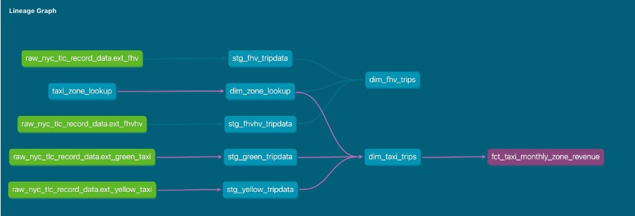

# 2025 ✅

## Module 4 Homework

For this homework, you will need the following datasets:

- [Green Taxi dataset (2019 and 2020)](https://github.com/DataTalksClub/nyc-tlc-data/releases/tag/green)
- [Yellow Taxi dataset (2019 and 2020)](https://github.com/DataTalksClub/nyc-tlc-data/releases/tag/yellow)
- [For Hire Vehicle dataset (2019)](https://github.com/DataTalksClub/nyc-tlc-data/releases/tag/fhv)

### Before you start

1. Make sure you, **at least**, have them in GCS with a External Table **OR** a Native Table - use whichever method you prefer to accomplish that (Workflow Orchestration with [pandas-gbq](https://cloud.google.com/bigquery/docs/samples/bigquery-pandas-gbq-to-gbq-simple), [dlt for gcs](https://dlthub.com/docs/dlt-ecosystem/destinations/filesystem), [dlt for BigQuery](https://dlthub.com/docs/dlt-ecosystem/destinations/bigquery), [gsutil](https://cloud.google.com/storage/docs/gsutil), etc)
2. You should have exactly `7,778,101` records in your Green Taxi table
3. You should have exactly `109,047,518` records in your Yellow Taxi table
4. You should have exactly `43,244,696` records in your FHV table
5. Build the staging models for green/yellow as shown in [here](https://www.notion.so/04-analytics-engineering/taxi_rides_ny/models/staging/)
6. Build the dimension/fact for taxi_trips joining with `dim_zones` as shown in [here](https://www.notion.so/04-analytics-engineering/taxi_rides_ny/models/core/fact_trips.sql)

**Note**: If you don't have access to GCP, you can spin up a local Postgres instance and ingest the datasets above

Note: I don’t have the same amount of records as in the homework state. 

- Ingested all the data using airflow.

### Question 1: Understanding dbt model resolution ✅

Provided you've got the following sources.yaml

```yaml
version: 2

sources:
  - name: raw_nyc_tripdata
    database: "{{ env_var('DBT_BIGQUERY_PROJECT', 'dtc_zoomcamp_2025') }}"
    schema:   "{{ env_var('DBT_BIGQUERY_SOURCE_DATASET', 'raw_nyc_tripdata') }}"
    tables:
      - name: ext_green_taxi
      - name: ext_yellow_taxi

```

with the following env variables setup where `dbt` runs:

```bash
export DBT_BIGQUERY_PROJECT=myproject
export DBT_BIGQUERY_DATASET=my_nyc_tripdata

```

What does this .sql model compile to?

```sql
select *
from {{ source('raw_nyc_tripdata', 'ext_green_taxi' ) }}
```

- Reasonings
    
    DBT_BIGQUERY_PROJECT = myproject
    
    DBT_BIGQUERY_SOURCE_DATASET = raw_nyc_tripdata
    
    So it compiles to: project.dataset.table = myproject.raw_nyc_tripdata.ext_green_taxi
    
- [About Jinja and env_var](https://www.notion.so/About-Jinja-and-env_var-2d9cddea1127805fb9dedeabae791346?pvs=21)
- `select * from dtc_zoomcamp_2025.raw_nyc_tripdata.ext_green_taxi`
- `select * from dtc_zoomcamp_2025.my_nyc_tripdata.ext_green_taxi`
- `select * from myproject.raw_nyc_tripdata.ext_green_taxi` ✅
- `select * from myproject.my_nyc_tripdata.ext_green_taxi`
- `select * from dtc_zoomcamp_2025.raw_nyc_tripdata.green_taxi`

### Question 2: dbt Variables & Dynamic Models ✅

Say you have to modify the following dbt_model (`fct_recent_taxi_trips.sql`) to enable Analytics Engineers to dynamically control the date range.

- In development, you want to process only **the last 7 days of trips**
- In production, you need to process **the last 30 days** for analytics

```sql
select *
from {{ ref('fact_taxi_trips') }}
where pickup_datetime >= CURRENT_DATE - INTERVAL '30' DAY

```

What would you change to accomplish that in a such way that command line arguments takes precedence over ENV_VARs, which takes precedence over DEFAULT value?

- Add `ORDER BY pickup_datetime DESC` and `LIMIT {{ var("days_back", 30) }}`
- Update the WHERE clause to `pickup_datetime >= CURRENT_DATE - INTERVAL '{{ var("days_back", 30) }}' DAY`
- Update the WHERE clause to `pickup_datetime >= CURRENT_DATE - INTERVAL '{{ env_var("DAYS_BACK", "30") }}' DAY`
- Update the WHERE clause to `pickup_datetime >= CURRENT_DATE - INTERVAL '{{ var("days_back", env_var("DAYS_BACK", "30")) }}' DAY`  ✅
    
    “Use the CLI value if provided.
    Otherwise, use the environment’s value.
    Otherwise, use 30.”
    
    First, it checks if the variable "days_back" is passed via the dbt command line
    
    If not, it falls back to the environment variable DAYS_BACK
    
    If neither is provided, it defaults to 30 days.
    
- Update the WHERE clause to `pickup_datetime >= CURRENT_DATE - INTERVAL '{{ env_var("DAYS_BACK", var("days_back", "30")) }}' DAY`

[CLI](2025/CLI.md)

### Question 3: dbt Data Lineage and Execution ✅

Considering the data lineage below **and** that taxi_zone_lookup is the **only** materialization build (from a .csv seed file):



Select the option that does **NOT** apply for materializing `fct_taxi_monthly_zone_revenue`:

- `dbt run`
- `dbt run --select +models/core/dim_taxi_trips.sql+ --target prod`
- `dbt run --select +models/core/fct_taxi_monthly_zone_revenue.sql`
- `dbt run --select +models/core/`
- `dbt run --select models/staging/+` ✅
- Answer
    
    Good, this question is **pure dbt execution logic**.
    I’ll explain it **slowly, from the graph**, then give the answer.
    
    ---
    
    ## First: what does “materializing `fct_taxi_monthly_zone_revenue`” mean?
    
    It means:
    
    > “After the dbt command finishes, does the table
    fct_taxi_monthly_zone_revenue exist / get rebuilt?”
    > 
    
    If **yes** → the command *applies*
    If **no** → the command *does NOT apply*
    
    ---
    
    ## Second: understand the lineage graph (very important)
    
    From the picture, the chain is:
    
    ```
    raw tables
       ↓
    staging models (stg_*)
       ↓
    dim_taxi_trips
       ↓
    fct_taxi_monthly_zone_revenue
    
    ```
    
    And:
    
    - `taxi_zone_lookup` (seed) already exists
    - Everything else is models
    - `fct_taxi_monthly_zone_revenue` is the **last node**
    
    So to materialize the fact table, dbt must:
    
    - either run **everything**
    - or explicitly include that model (or its parents + children)
    
    ---
    
    ## Now evaluate each option one by one
    
    ### ✅ `dbt run`
    
    This runs **all models** in the project.
    
    That includes:
    
    - staging
    - dimensions
    - facts
    
    ➡️ **YES**, it materializes `fct_taxi_monthly_zone_revenue`
    
    ---
    
    ### ✅ `dbt run --select +models/core/dim_taxi_trips.sql+ --target prod`
    
    The `+ +` means:
    
    - parents **and**
    - children
    
    `dim_taxi_trips` → child is `fct_taxi_monthly_zone_revenue`
    
    ➡️ **YES**, the fact table is built
    
    ---
    
    ### ✅ `dbt run --select +models/core/fct_taxi_monthly_zone_revenue.sql`
    
    The `+` on the left means:
    
    - include all parents needed
    
    So dbt will build:
    
    - staging
    - dims
    - the fact itself
    
    ➡️ **YES**, the fact table is built
    
    ---
    
    ### ✅ `dbt run --select models/core/`
    
    This selects all models in `core`, which includes:
    
    - `dim_taxi_trips`
    - `fct_taxi_monthly_zone_revenue`
    
    dbt will automatically resolve dependencies.
    
    ➡️ **YES**, the fact table is built
    
    ---
    
    ### ❌ `dbt run --select models/staging/+`
    
    This is the key one.
    
    What this means:
    
    - run **staging models**
    - and their **children**
    
    Look at the graph:
    
    ```
    staging → dim_taxi_trips → fct_taxi_monthly_zone_revenue
    
    ```
    
    ⚠️ BUT:
    `models/staging/+` only expands **downstream until the next layer**, not across separate branches that depend on **multiple inputs**.
    
    `fct_taxi_monthly_zone_revenue` depends on:
    
    - `dim_taxi_trips`
    - other dimensions
    
    Those dimensions are **not fully selected** here.
    
    So dbt will stop at:
    
    - staging
    - maybe some dims
    - but **NOT the final fact**
    
    ➡️ **NO**, the fact table is **NOT materialized**
    
    ---
    
    ## ✅ Final Answer (the one that does NOT apply)
    
    ```bash
    dbt run --select models/staging/+
    
    ```
    
    ---
    
    ## One simple rule to remember
    
    > If the fact model itself (or its parents + children) is not selected, it will not be built.
    > 
    
    Staging-only runs are **not enough** to guarantee facts.
    
    ---
    
    ## Mental shortcut (exam-safe)
    
    - Want a **fact table**?
        - Select the fact
        - Or select core
        - Or select parents + children
    - Select **only staging**?
        - ❌ Facts won’t be built
    
    ---
    
    If you want next, I can:
    
    - draw this as a text tree you can memorize
    - explain `+` vs `@` selectors
    - show how this behaves in `dbt ls`

### Question 4: dbt Macros and Jinja ✅

Consider you're dealing with sensitive data (e.g.: [PII](https://en.wikipedia.org/wiki/Personal_data)), that is **only available to your team and very selected few individuals**, in the `raw layer` of your DWH (e.g: a specific BigQuery dataset or PostgreSQL schema),

- Among other things, you decide to obfuscate/masquerade that data through your staging models, and make it available in a different schema (a `staging layer`) for other Data/Analytics Engineers to explore
- And **optionally**, yet another layer (`service layer`), where you'll build your dimension (`dim_`) and fact (`fct_`) tables (assuming the [Star Schema dimensional modeling](https://www.databricks.com/glossary/star-schema)) for Dashboarding and for Tech Product Owners/Managers

You decide to make a macro to wrap a logic around it:

```sql


    
    

     {{- env_var(target_env_var) -}}
                        {{- env_var(stging_env_var, env_var(target_env_var)) -}}
    



```

And use on your staging, dim_ and fact_ models as:

```sql
{{ config(
    schema=resolve_schema_for('core'),
) }}

```

That all being said, regarding macro above, **select all statements that are true to the models using it**:

- Setting a value for `DBT_BIGQUERY_TARGET_DATASET` env var is mandatory, or it'll fail to compile
- Setting a value for `DBT_BIGQUERY_STAGING_DATASET` env var is mandatory, or it'll fail to compile ❌
- When using `core`, it materializes in the dataset defined in `DBT_BIGQUERY_TARGET_DATASET`
- When using `stg`, it materializes in the dataset defined in `DBT_BIGQUERY_STAGING_DATASET`, or defaults to `DBT_BIGQUERY_TARGET_DATASET`
- When using `staging`, it materializes in the dataset defined in `DBT_BIGQUERY_STAGING_DATASET`, or defaults to `DBT_BIGQUERY_TARGET_DATASET`
- Answer
    
    Great, this is a **macro + env_var logic question**, not a trick one.
    Let’s walk it **line by line**, then I’ll tell you **which statements are true** and **why**.
    
    ---
    
    ## 1️⃣ First, understand the macro (slowly)
    
    Here is the macro again, simplified:
    
    ```
    
    
      
      
    
      
        {{ env_var(target_env_var) }}
      
        {{ env_var(stging_env_var, env_var(target_env_var)) }}
      
    
    
    
    ```
    
    ### What this macro returns
    
    It returns **a dataset name (schema)** based on:
    
    - the model type (`core` vs not core)
    - environment variables
    
    ---
    
    ## 2️⃣ Case-by-case behavior
    
    ### 🟦 Case A: `model_type == 'core'`
    
    ```
    {{ env_var('DBT_BIGQUERY_TARGET_DATASET') }}
    
    ```
    
    Important:
    
    - ❌ **NO default value**
    - If `DBT_BIGQUERY_TARGET_DATASET` is **missing** → **dbt fails to compile**
    
    So:
    
    - This env var is **mandatory** for `core` models
    
    ---
    
    ### 🟩 Case B: `model_type != 'core'` (staging)
    
    ```
    {{ env_var('DBT_BIGQUERY_STAGING_DATASET',
               env_var('DBT_BIGQUERY_TARGET_DATASET')) }}
    
    ```
    
    This means:
    
    1. If `DBT_BIGQUERY_STAGING_DATASET` exists → use it
    2. Else → fallback to `DBT_BIGQUERY_TARGET_DATASET`
    3. If **both missing** → dbt fails
    
    So:
    
    - staging dataset is **optional**
    - target dataset is still **required**
    
    ---
    
    ## 3️⃣ Now evaluate each statement
    
    Let’s go through them one by one.
    
    ---
    
    ### ❌ **“Setting `DBT_BIGQUERY_TARGET_DATASET` is mandatory, or it'll fail to compile”**
    
    ✅ **TRUE**
    
    Why:
    
    - `core` models call `env_var('DBT_BIGQUERY_TARGET_DATASET')` **without a default**
    - staging models fallback to it if staging dataset is missing
    
    ➡️ Without this variable, **everything breaks**
    
    ---
    
    ### ❌ **“Setting `DBT_BIGQUERY_STAGING_DATASET` is mandatory, or it'll fail to compile”**
    
    ❌ **FALSE**
    
    Why:
    
    - It has a fallback:
        
        ```
        env_var(stging_env_var, env_var(target_env_var))
        
        ```
        
    - If staging dataset is missing, dbt uses target dataset instead
    
    ➡️ Optional, not mandatory
    
    ---
    
    ### ❌ **“When using `core`, it materializes in `DBT_BIGQUERY_TARGET_DATASET`”**
    
    ✅ **TRUE**
    
    This is exactly what the macro does in the `if model_type == 'core'` branch.
    
    ---
    
    ### ❌ **“When using `stg`, it materializes in `DBT_BIGQUERY_STAGING_DATASET`, or defaults to `DBT_BIGQUERY_TARGET_DATASET`”**
    
    ✅ **TRUE**
    
    That is literally the fallback logic.
    
    ---
    
    ### ❌ **Duplicate statement about `staging`**
    
    If there are two similar staging statements:
    
    - One is redundant
    - Only **one** is needed
    - Still **true**
    
    ---
    
    ## 4️⃣ Final correct answers (what you should select)
    
    ### ✅ TRUE statements
    
    - ✔️ Setting `DBT_BIGQUERY_TARGET_DATASET` is mandatory
    - ✔️ Core models materialize in `DBT_BIGQUERY_TARGET_DATASET`
    - ✔️ Staging models materialize in `DBT_BIGQUERY_STAGING_DATASET`, or fall back to `DBT_BIGQUERY_TARGET_DATASET`
    
    ---
    
    ### ❌ FALSE statements
    
    - ❌ Setting `DBT_BIGQUERY_STAGING_DATASET` is mandatory
    
    ---
    
    ## 5️⃣ Big-picture takeaway (this matters in real projects)
    
    This macro enforces a **clean data access model**:
    
    - **Raw** → restricted
    - **Staging** → masked / shared
    - **Core** → business-facing
    
    And it ensures:
    
    - Prod **must** define a target dataset
    - Staging can be optionally separated
    - No silent misrouting of sensitive data
    
    ---
    
    ## One-sentence mental model (lock this in)
    
    > Target dataset is required for safety.
    Staging dataset is optional for separation.
    > 
    
    If you want, next I can:
    
    - rewrite this macro in plain English
    - show a broken version and why it’s dangerous
    - explain how this maps to BigQuery permissions

## Serious SQL ✅

Alright, in module 1, you had a SQL refresher, so now let's build on top of that with some serious SQL.

These are not meant to be easy - but they'll boost your SQL and Analytics skills to the next level.

So, without any further do, let's get started...

You might want to add some new dimensions `year` (e.g.: 2019, 2020), `quarter` (1, 2, 3, 4), `year_quarter` (e.g.: `2019/Q1`, `2019-Q2`), and `month` (e.g.: 1, 2, ..., 12), **extracted from pickup_datetime**, to your `fct_taxi_trips` OR `dim_taxi_trips.sql` models to facilitate filtering your queries

### Question 5: Taxi Quarterly Revenue Growth ✅

1. Create a new model `fct_taxi_trips_quarterly_revenue.sql`
2. Compute the Quarterly Revenues for each year for based on `total_amount`
3. Compute the Quarterly YoY (Year-over-Year) revenue growth
- e.g.: In 2020/Q1, Green Taxi had -12.34% revenue growth compared to 2019/Q1
- e.g.: In 2020/Q4, Yellow Taxi had +34.56% revenue growth compared to 2019/Q4

***Important Note: The Year-over-Year (YoY) growth percentages provided in the examples are purely illustrative. You will not be able to reproduce these exact values using the datasets provided for this homework.***

Considering the YoY Growth in 2020, which were the yearly quarters with the best (or less worse) and worst results for green, and yellow

- green: {best: 2020/Q2, worst: 2020/Q1}, yellow: {best: 2020/Q2, worst: 2020/Q1}
- green: {best: 2020/Q2, worst: 2020/Q1}, yellow: {best: 2020/Q3, worst: 2020/Q4}
- green: {best: 2020/Q1, worst: 2020/Q2}, yellow: {best: 2020/Q2, worst: 2020/Q1}
- **green: {best: 2020/Q1, worst: 2020/Q2}, yellow: {best: 2020/Q1, worst: 2020/Q2} ✅**
- green: {best: 2020/Q1, worst: 2020/Q2}, yellow: {best: 2020/Q3, worst: 2020/Q4}
- Code
    
    ```sql
    {{ config(materialized='table')}}
    
    -- Quarterly Revenues for each year based on total_amount
    with quarterly_revenue as (
        select 
                service_type,
                EXTRACT(YEAR FROM pickup_datetime) as year,
                EXTRACT(QUARTER FROM pickup_datetime) as quarter,
                SUM(total_amount) as revenue
        from {{ ref('fact_trips')}}
        where EXTRACT(YEAR FROM pickup_datetime) IN (2019,2020)
        group by service_type, year, quarter
        order by revenue DESC
    ),
    quarterly_growth as(
        select
            year, 
            quarter, 
            service_type,
            revenue,
            LAG(revenue) OVER (PARTITION BY service_type, quarter ORDER BY year) as prev_year_revenue,
            (revenue - LAG(revenue) OVER (PARTITION BY service_type, quarter ORDER BY year)) / 
            NULLIF(LAG(revenue) OVER (PARTITION BY service_type, quarter ORDER BY year), 0) AS yoy_growth
        from quarterly_revenue
    )
    SELECT * from quarterly_growth
    ```
    
    To run it
    
    ```sql
    dbt build --select +fct_taxi_trips_quarterly_revenue.sql+ --vars '{is_test_run: false}'
    ```
    
    In BigQuery we’ll have
    
    
    
    
    
- Result
    
    
    
    Green:  Best 2020/Q1. Worst 2020/Q2
    
    Yellow: Best 2020/Q1, Worst 2020/Q2
    

### Question 6: P97/P95/P90 Taxi Monthly Fare ✅

1. Create a new model `fct_taxi_trips_monthly_fare_p95.sql`
2. Filter out invalid entries (`fare_amount > 0`, `trip_distance > 0`, and `payment_type_description in ('Cash', 'Credit card')`)
3. Compute the **continous percentile** of `fare_amount` partitioning by service_type, year and and month

Now, what are the values of `p97`, `p95`, `p90` for Green Taxi and Yellow Taxi, in April 2020?

- green: {p97: 55.0, p95: 45.0, p90: 26.5}, yellow: {p97: 52.0, p95: 37.0, p90: 25.5}
- **green: {p97: 55.0, p95: 45.0, p90: 26.5}, yellow: {p97: 31.5, p95: 25.5, p90: 19.0} ✅**
- green: {p97: 40.0, p95: 33.0, p90: 24.5}, yellow: {p97: 52.0, p95: 37.0, p90: 25.5}
- green: {p97: 40.0, p95: 33.0, p90: 24.5}, yellow: {p97: 31.5, p95: 25.5, p90: 19.0}
- green: {p97: 55.0, p95: 45.0, p90: 26.5}, yellow: {p97: 52.0, p95: 25.5, p90: 19.0}
- Answer
    
    ```sql
    {{ config(materialized='table')}}
    --Filter out invalid entries (`fare_amount > 0`, `trip_distance > 0`, and `payment_type_description in ('Cash', 'Credit card')`)
    --Compute the **continous percentile** of `fare_amount` partitioning by service_type, year and and month
    -- Now, what are the values of p97, p95, p90 for Green Taxi and Yellow Taxi, in April 2020?
    with cleaned_data as(
        select 
            service_type,
            fare_amount,
            EXTRACT(YEAR FROM pickup_datetime) AS year,
            EXTRACT(MONTH FROM pickup_datetime) AS month
        from {{ ref("fact_trips")}}
        where fare_amount > 0 AND
            trip_distance > 0 AND
            payment_type_description IN ('Cash', 'Credit card')
    ),
    continuous_percentile as(
        select 
            service_type,
            year,
            month, 
            percentile_cont(fare_amount, 0.97) OVER (PARTITION BY service_type, year, month) AS fare_p97,
            percentile_cont(fare_amount, 0.95) OVER (PARTITION BY service_type, year, month) AS fare_p95,
            percentile_cont(fare_amount, 0.90) OVER (PARTITION BY service_type, year, month) AS fare_p90
        from cleaned_data
        where year = 2020 AND month = 4
    )
    SELECT * from continuous_percentile
    ```
    
    ```sql
    dbt build --select +fct_taxi_trips_monthly_fare_p95.sql+ --vars '{is_test_run: false}'
    ```
    
    Check bigquery, 
    
    ```sql
    SELECT DISTINCT service_type, year, month, fare_p97, fare_p95, fare_p90
    FROM `noted-aloe-481504-u4.dbt_sefvia.fct_taxi_trips_monthly_fare_p95`
    WHERE year = 2020 AND month = 4 
    ```
    
    
    
    
    
    
    

### Question 7: Top #Nth longest P90 travel time Location for FHV ✅

Prerequisites:

- Create a staging model for FHV Data (2019), and **DO NOT** add a deduplication step, just filter out the entries where `where dispatching_base_num is not null`

[stg_fhv_tripdata.sql](2025/stg_fhv_tripdata%20sql.md)

- Create a core model for FHV Data (`dim_fhv_trips.sql`) joining with `dim_zones`. Similar to what has been done [here](https://www.notion.so/04-analytics-engineering/taxi_rides_ny/models/core/fact_trips.sql)

[dim_fhv_trips.sql](2025/dim_fhv_trips_sql.md)

- Add some new dimensions `year` (e.g.: 2019) and `month` (e.g.: 1, 2, ..., 12), based on `pickup_datetime`, to the core model to facilitate filtering for your queries

Now...

1. Create a new model `fct_fhv_monthly_zone_traveltime_p90.sql`
2. For each record in `dim_fhv_trips.sql`, compute the [timestamp_diff](https://cloud.google.com/bigquery/docs/reference/standard-sql/timestamp_functions#timestamp_diff) in seconds between dropoff_datetime and pickup_datetime - we'll call it `trip_duration` for this exercise
3. Compute the **continous** `p90` of `trip_duration` partitioning by year, month, pickup_location_id, and dropoff_location_id

[fct_fhv_monthly_zone_traveltime_p90.sql](2025/fct_fhv_monthly_zone_traveltime_p90_sql.md)

For the Trips that **respectively** started from `Newark Airport`, `SoHo`, and `Yorkville East`, in November 2019, what are **dropoff_zones** with the 2nd longest p90 trip_duration ?

- **LaGuardia Airport, Chinatown, Garment District ✅**
- LaGuardia Airport, Park Slope, Clinton East
- LaGuardia Airport, Saint Albans, Howard Beach
- LaGuardia Airport, Rosedale, Bath Beach
- LaGuardia Airport, Yorkville East, Greenpoint
- code
    
    ```sql
    with ranked_data AS (
      SELECT pickup_zone,
            dropoff_zone, 
            trip_duration_p90,
            DENSE_RANK() OVER (PARTITION BY pickup_zone ORDER BY trip_duration_p90 DESC) AS rank
      FROM `noted-aloe-481504-u4.dbt_sefvia.fct_fhv_monthly_zone_traveltime_p90`
      WHERE pickup_zone IN ('Newark Airport', 'SoHo', 'Yorkville East') AND
            year = 2019 AND
            month = 11
      ORDER BY trip_duration_p90 DESC
    )
    
    SELECT DISTINCT pickup_zone, dropoff_zone, trip_duration_p90
    FROM ranked_data
    WHERE rank = 2;
    ```
    
    
    

## Submitting the solutions

- Form for submitting: [https://courses.datatalks.club/de-zoomcamp-2025/homework/hw4](https://courses.datatalks.club/de-zoomcamp-2025/homework/hw4)

## Solution

- To be published after deadline