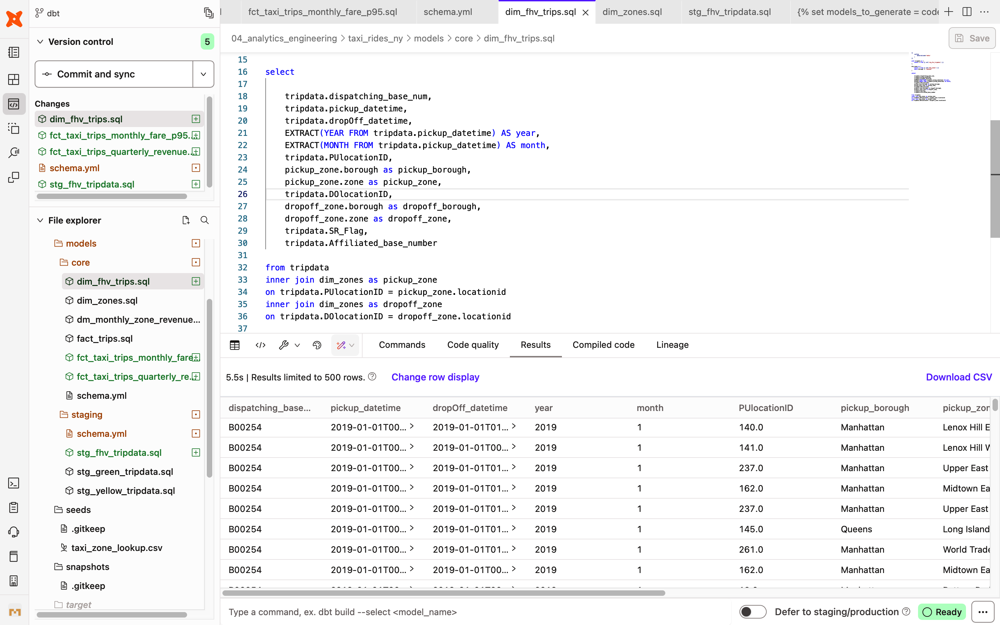

# dim_fhv_trips.sql

```sql
{{
    config(
        materialized='table'
    )
}}

with tripdata as (
    select * from {{ ref('stg_fhv_tripdata') }}
), 

dim_zones as (
    select * from {{ ref('dim_zones') }}
    where borough != 'Unknown'
)

select 

    tripdata.dispatching_base_num, 
    tripdata.pickup_datetime, 
    tripdata.dropOff_datetime,
    EXTRACT(YEAR FROM tripdata.pickup_datetime) AS year,
    EXTRACT(MONTH FROM tripdata.pickup_datetime) AS month,
    tripdata.PUlocationID, 
    pickup_zone.borough as pickup_borough, 
    pickup_zone.zone as pickup_zone, 
    tripdata.DOlocationID, 
    dropoff_zone.borough as dropoff_borough, 
    dropoff_zone.zone as dropoff_zone,  
    tripdata.SR_Flag,
    tripdata.Affiliated_base_number

from tripdata
inner join dim_zones as pickup_zone
on tripdata.PUlocationID = pickup_zone.locationid
inner join dim_zones as dropoff_zone
on tripdata.DOlocationID = dropoff_zone.locationid

```



```sql
dbt build --select dim_fhv_trips --vars '{is_test_run: false}'
```

In BigQuery:

