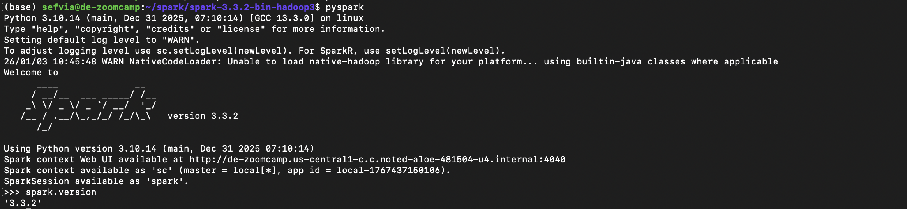

# 2025 ✅

# Module 5 Homework

In this homework we'll put what we learned about Spark in practice.

For this homework we will be using the Yellow 2024-10 data from the official website:

```bash
wget https://d37ci6vzurychx.cloudfront.net/trip-data/yellow_tripdata_2024-10.parquet

```

## Question 1: Install Spark and PySpark ✅

- Install Spark
- Run PySpark
- Create a local spark session
- Execute spark.version.

What's the output? = `3.3.2`

- Step by step
    
    Run pyspark in vm, creating local spark session
    
    ```sql
    ./sbin/start-master.sh
    ```
    
    ```sql
    URL = spark://de-zoomcamp.us-central1-c.c.noted-aloe-481504-u4.internal:7077
    ```
    
    ```sql
    ./sbin/start-worker.sh spark://de-zoomcamp.us-central1-c.c.noted-aloe-481504-u4.internal:7077
    ```
    
    
    

## Question 2: Yellow October 2024 ✅

Read the October 2024 Yellow into a Spark Dataframe.

Repartition the Dataframe to 4 partitions and save it to parquet.

What is the average size of the Parquet (ending with .parquet extension) Files that were created (in MB)? Select the answer which most closely matches.

- 6MB
- **25MB ✅**
- 75MB
- 100MB
- Step by Step
    
    Open Jupyter Notebook
    
    ```sql
    import pyspark
    from pyspark.sql import SparkSession
    
    spark = SparkSession.builder \
            .master("spark://de-zoomcamp.us-central1-c.c.noted-aloe-481504-u4.internal:7077") \
            .appName('test') \
            .getOrCreate()
    
    !wget https://d37ci6vzurychx.cloudfront.net/trip-data/yellow_tripdata_2024-10.parquet
    
    df_yellow = spark.read.parquet('yellow_tripdata_2024-10.parquet')
    
    df_yellow.printSchema()
    
    df_yellow_clean = df_yellow \
        .repartition(4) \
        .write \
        .mode("overwrite") \
        .parquet('data/pq/yellow/2024/10')
        
    !ls data/pq/yellow/2024/10
    !ls -lh data/pq/yellow/2024/10
    ```
    
    
    
    
    

## Question 3: Count records ✅

How many taxi trips were there on the 15th of October?

Consider only trips that started on the 15th of October.

- 85,567
- 105,567
- **125,567 ✅**
- 145,567
- Step by Step
    
    We now have the file, now we need to ingest it somewhere and query it. 
    
    We can go by a few approach:
    
    - Using pyspark
        
        ```sql
        import pyspark
        from pyspark.sql import SparkSession
        
        spark = SparkSession.builder \
                .master("spark://de-zoomcamp.us-central1-c.c.noted-aloe-481504-u4.internal:7077") \
                .appName('test') \
                .getOrCreate()
        
        df_yellow = spark.read.parquet('yellow_tripdata_2024-10.parquet')
        
        df_yellow_clean = df_yellow \
            .repartition(4) \
            .write \
            .mode("overwrite") \
            .parquet('data/pq/yellow/2024/10')
        
        df_yellow_clean = spark.read.parquet('data/pq/yellow/2024/10/*')
        df_yellow_clean.registerTempTable('yellow_trip_data')
        
        df_result = spark.sql("""
        SELECT 
            COUNT(*)
        FROM
            yellow_trip_data
        WHERE
            DATE_TRUNC('day', tpep_pickup_datetime) = '2024-10-15'
        """)
        ```
        
        
        
        
        
    - Uploading it into GCS and query it in BQ
        
        Because I already downloaded the data in the pq/ folder, let’s send it to bucket
        
        ```sql
        gsutil -m cp -r pq/* gs://zoomcamp-datalake-sefvia/pq
        ```
        
        ```sql
        #!/usr/bin/env python
        # coding: utf-8
        import argparse
        import pyspark
        from pyspark.sql import SparkSession
        
        spark = SparkSession.builder \
                .appName('test') \
                .getOrCreate()
        
        parser = argparse.ArgumentParser()
        #parser.add_argument('--input_green', required=True)
        parser.add_argument('--input_yellow', required=True)
        parser.add_argument('--output', required=True)
        
        args = parser.parse_args()
        
        input_yellow = args.input_yellow
        output = args.output
        
        spark.conf.set('temporaryGcsBucket', 'dataproc-temp-us-central1-766902276932-b7zoufg0')
        
        df_yellow = spark.read.parquet(input_yellow)
        
        df_yellow.write.format('bigquery') \
            .option('table', output) \
            .mode('overwrite') \
            .save()
        
        ```
        
        Upload code to gcs
        
        ```sql
        gsutil cp 10_hw_q2_bq.py gs://zoomcamp-datalake-sefvia/code/10_hw_q2_bq.py
        ```
        
        ```sql
        gcloud dataproc jobs submit pyspark \
            --cluster=de-zoomcamp-cluster \
            --region=us-central1 \
            gs://zoomcamp-datalake-sefvia/code/10_hw_q2_bq.py \
            -- \
                --input_yellow=gs://zoomcamp-datalake-sefvia/pq/yellow/2024/*/ \
                --output=nytaxi.reports-2024
        ```
        
        
        
        Query it in BQ
        
        ```sql
        SELECT COUNT(*)
        FROM `noted-aloe-481504-u4.nytaxi.reports-2024`
        WHERE DATE(tpep_pickup_datetime) = '2024-10-15';
        ```
        
        
        

## Question 4: Longest trip ✅

What is the length of the longest trip in the dataset in hours?

- 122
- 142
- **162 ✅**
- 182
- Pyspark
    
    ```sql
    ## What is the length of the longest trip in the dataset in hours?
    df_max_duration = spark.sql("""
    SELECT 
        timestampdiff(HOUR, tpep_pickup_datetime, tpep_dropoff_datetime) as trip_duration
    FROM
        yellow_trip_data
    ORDER BY
        trip_duration DESC
    """)
    df_max_duration.show()
    ```
    
    
    
- GCS BigQuery
    
    ```sql
    SELECT timestamp_diff(tpep_dropoff_datetime, tpep_pickup_datetime, hour) AS trip_duration
    FROM `noted-aloe-481504-u4.nytaxi.reports-2024`
    ORDER BY trip_duration DESC
    LIMIT 5;
    ```
    
    
    

## Question 5: User Interface ✅

Spark’s User Interface which shows the application's dashboard runs on which local port?

- 80
- 443
- 4040 ✅
- 8080


Spark Standalone Cluster Manager UI → 8080

## Question 6: Least frequent pickup location zone ✅

Load the zone lookup data into a temp view in Spark:

```bash
wget <https://d37ci6vzurychx.cloudfront.net/misc/taxi_zone_lookup.csv>

```

Using the zone lookup data and the Yellow October 2024 data, what is the name of the LEAST frequent pickup location Zone?

- **Governor's Island/Ellis Island/Liberty Island ✅**
- Arden Heights
- Rikers Island
- Jamaica Bay
- Pyspark
    
    ```sql
    ## Using the zone lookup data and the Yellow October 2024 data, what is the name of the LEAST frequent pickup location Zone?
    df_zones = spark.read.parquet('zones/*')
    
    df_zones.registerTempTable('zones')
    
    df_join = spark.sql("""
    SELECT 
        pickup_zone.Zone AS pickup_zones,
        COUNT(*) AS zones_count
    FROM
        yellow_trip_data y
    INNER JOIN zones pickup_zone
    ON y.PULocationID = pickup_zone.LocationID
    WHERE YEAR(tpep_pickup_datetime) = 2024 AND MONTH(tpep_pickup_datetime) = 10
    GROUP BY pickup_zone.Zone
    ORDER BY zones_count ASC
    LIMIT 10
    """)
    
    df_join.show(10)
    ```
    
    
    
- GCS
    
    Uploading the zones data that we have downloaded 
    
    Now we have the zone data in the `zones` folder, we want to upload it to gcs
    
    ```sql
    gsutil -m cp -r zones/* gs://zoomcamp-datalake-sefvia/zones/
    ```
    
    make a python code:
    
    ```sql
    #!/usr/bin/env python
    # coding: utf-8
    import argparse
    import pyspark
    from pyspark.sql import SparkSession
    
    spark = SparkSession.builder \
            .appName('test') \
            .getOrCreate()
    
    parser = argparse.ArgumentParser()
    #parser.add_argument('--input_green', required=True)
    parser.add_argument('--input_yellow', required=True)
    parser.add_argument('--input_zones', required=True)
    parser.add_argument('--output', required=True)
    
    args = parser.parse_args()
    
    input_yellow = args.input_yellow
    input_zones = args.input_zones
    output = args.output
    
    spark.conf.set('temporaryGcsBucket', 'dataproc-temp-us-central1-766902276932-b7zoufg0')
    
    df_yellow = spark.read.parquet(input_yellow)
    
    df_zones = spark.read.parquet(input_zones)
    
    df_yellow.registerTempTable('yellow_trip_data')
    df_zones.registerTempTable('zones_data')
    
    df_test = spark.sql("""
    SELECT 
        y.VendorID,
        y.tpep_pickup_datetime AS pickup_time,
        y.tpep_dropoff_datetime AS dropoff_time,
        y.passenger_count,
        y.trip_distance,
        y.RatecodeID,
        y.store_and_fwd_flag,
        pickup_zone.LocationID AS pickup_zone_ID,
        pickup_zone.Borough AS pickup_borough,
        pickup_zone.Zone AS pickup_zone,
        pickup_zone.service_zone AS pickup_service_zone,
        dropoff_zone.LocationID AS dropoff_zone_ID,
        dropoff_zone.Borough AS dropoff_borough,
        dropoff_zone.Zone AS dropoff_zone,
        dropoff_zone.service_zone AS dropoff_service_zone,
        y.payment_type,
        y.fare_amount,
        y.extra,
        y.mta_tax,
        y.tip_amount, 
        y.tolls_amount, 
        y.improvement_surcharge,
        y.total_amount,
        y.congestion_surcharge,
        y.Airport_fee
    FROM
        yellow_trip_data y
    INNER JOIN zones_data pickup_zone
    ON y.PULocationID = pickup_zone.LocationID
    INNER JOIN zones_data dropoff_zone
    ON y.DOLocationID = dropoff_zone.LocationID
    WHERE YEAR(tpep_pickup_datetime) = 2024 AND MONTH(tpep_pickup_datetime) = 10
    """)
    
    df_test.write.format('bigquery') \
        .option('table', output) \
        .mode('overwrite') \
        .save()
    ```
    
    Upload code to gcs:
    
    ```sql
    gsutil cp 10_hw_q6_bq.py gs://zoomcamp-datalake-sefvia/code/10_hw_q6_bq.py
    ```
    
    ```sql
    gcloud dataproc jobs submit pyspark \
        --cluster=de-zoomcamp-cluster \
        --region=us-central1 \
        gs://zoomcamp-datalake-sefvia/code/10_hw_q6_bq.py \
        -- \
            --input_yellow=gs://zoomcamp-datalake-sefvia/pq/yellow/2024/*/ \
            --input_zones=gs://zoomcamp-datalake-sefvia/zones \
            --output=nytaxi.zone_reports-2024
    ```
    
    
    
    ```sql
    ## Using the zone lookup data and the Yellow October 2024 data, what is the name of the LEAST frequent pickup location Zone?
    SELECT pickup_zone,
          COUNT(*)
    FROM `noted-aloe-481504-u4.nytaxi.zone_reports-2024`
    WHERE EXTRACT(YEAR FROM pickup_time) = 2024 AND EXTRACT(MONTH FROM pickup_time) = 10
    GROUP BY pickup_zone
    ORDER BY COUNT(*) ASC
    LIMIT 10;
    ```
    
    
    

## Submitting the solutions

- Form for submitting: [https://courses.datatalks.club/de-zoomcamp-2025/homework/hw5](https://courses.datatalks.club/de-zoomcamp-2025/homework/hw5)
- Deadline: See the website